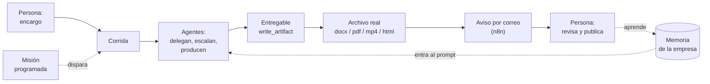

# Visión del producto

## Qué es

Una herramienta para **modelar una empresa completa con agentes LLM y verla
operar**. Configurás departamentos, roles, herramientas y políticas; le das un
encargo en una caja de texto; y mirás cómo los agentes se escriben entre sí,
delegan, escalan, piden aprobación y producen entregables reales — con el costo
a la vista y un tope que corta solo.

Corre local, un solo usuario, sin infraestructura externa más allá del proveedor
LLM y los servidores MCP que conectes.

## Qué NO es

- **No es un chat con un agente.** Son varios agentes que no comparten contexto
  y se comunican por mensajería, como una organización real.
- **No es un framework para programadores.** Una empresa se arma desde la UI o
  desde un JSON ([[Modelo de dominio|blueprint]]), no escribiendo código.
- **No es un producto multiusuario.** Ver [[Estado del producto]] para el alcance.

## Las tres ideas que lo definen

### 1. Los agentes no comparten contexto

Cada rol tiene bandeja propia y sólo sabe lo que le escriben. Toda la
coordinación pasa por herramientas: `send_message`, `reply`, `assign_task`,
`escalate`, `request_approval`, `write_artifact`. Y la jerarquía se valida **en
código**, no en el prompt: un agente puede ignorar una instrucción, pero no
puede saltearse el ejecutor de la herramienta. Ver [[Coordinación entre agentes]].

Esa restricción no es una limitación técnica: es lo que hace que el sistema se
parezca a una empresa y no a un modelo grande con muchas personalidades. Un
ejecutor que quiere asignarle una tarea a su jefe recibe el error y la lista de
su equipo real.

### 2. La empresa produce archivos, no párrafos

El resultado de una corrida no es texto en pantalla: es un `.docx` con portada y
numeración, un `.pdf`, un `.mp4` narrado con música, un deck `.html` que se
adjunta a un correo. Los agentes **crean, modifican y borran** sobre un
directorio propio de la empresa, con permisos que dependen de su nivel de
autoridad. Ver [[Habilidades de producción]] y [[Producción audiovisual]].

### 3. Todo paso es visible

El motor emite un evento por cada cosa que ocurre; el servidor los persiste y
los reemite por SSE; la UI **no hace polling**. Como el estado se deriva de la
traza, "ver en vivo" y "retroceder en el timeline" son la misma operación con un
corte distinto — por eso el replay muestra exactamente lo que se vio la primera
vez. Ver [[Observabilidad y trazas]].

## El circuito completo

El único eslabón que un agente **no** puede hacer es el último: publicar mueve
el archivo a `publicado/`, y eso lo decide una persona. Ver
[[Misiones programadas]].

## Por qué existe cada restricción

| Restricción | Qué evita |
|---|---|
| Presupuesto por corrida, evaluado antes de cada turno | que una corrida se coma el saldo del proveedor |
| Tope de ciclos con presión de cierre creciente | que la empresa se pida datos entre sí hasta morir sin producir nada |
| Un tick de retardo en la mensajería | ida y vuelta infinito entre dos agentes dentro del mismo ciclo |
| `send_message` rechaza insistirle a quien no contestó | diez mensajes a la misma persona en una corrida |
| Corte al agente que repite una llamada fallida | que un error irresoluble consuma las `maxTurns` enteras |
| Corte por tiempo en toda llamada de red | que un proveedor que acepta la conexión y se calla cuelgue la corrida |

Ver [[Costos y presupuesto]] y [[Motor de agentes]].

## Enlaces

- [[Problema y público]] — a quién le sirve esto
- [[Estado del producto]] — qué está verificado contra un LLM real
- [[Arquitectura general]] — cómo está construido
- [[Casos de uso]] — recorridos completos
