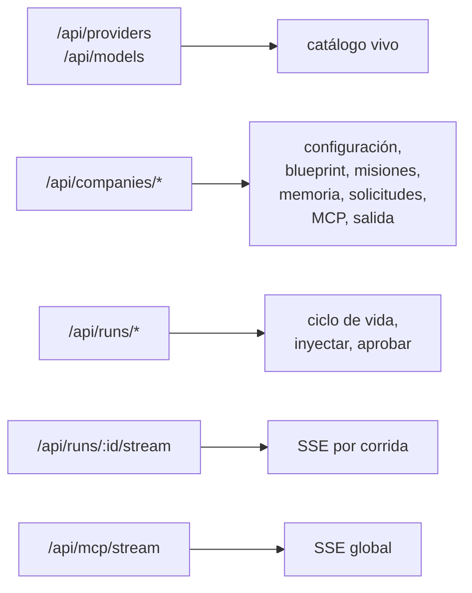

# API HTTP y SSE

`apps/server/src/routes.ts`. Fastify, puerto `3001` por defecto. La lista
completa está en [[Referencia de API]]; esta nota explica el contrato y sus
particularidades.

## Arranque

`apps/server/src/index.ts` en orden: cargar y **validar** el entorno
(`loadEnv`), construir el `Store` (que aplica el esquema), construir el
`Runtime`, registrar las rutas, arrancar el `MisionScheduler`.

Validar el entorno una sola vez al arrancar es deliberado: un valor mal puesto
falla ahí y no en medio de una corrida. Ver [[Variables de entorno]].

## Cinco familias de rutas

## Los dos canales SSE

| Canal | Alcance | Por qué separado |
|---|---|---|
| `GET /api/runs/:id/stream` | eventos de **una corrida** | es la traza que la UI deriva |
| `GET /api/mcp/stream` | salud de MCP, **global** | las conexiones viven mientras el servidor esté arriba, aunque no haya ninguna corrida |

El flujo es siempre el mismo: el motor emite a `EventBus` → el servidor
**persiste** en la tabla `events` con su `seq` → **reemite** a los suscriptores.
Persistir antes de reemitir es lo que hace que el replay muestre exactamente lo
que se vio en vivo. Ver [[Observabilidad y trazas]].

## El directorio de salida por HTTP

Cinco rutas sobre `data/exports/<empresa>/`:

| Ruta | Qué hace |
|---|---|
| `GET /api/companies/:id/exports` | el árbol de archivos |
| `POST /api/companies/:id/exports/folders` | crear carpeta |
| `DELETE /api/companies/:id/exports/*` | borrar (**sin** las reglas de jerarquía: acá decidís vos) |
| `GET /api/companies/:id/exports/*` | descargar; con `?inline` se dibuja en el navegador |
| `GET /api/companies/:id/exports-preview/*` | vista previa |
| `POST /api/companies/:id/exports-publicar/*` | mover a `publicado/` |

### `?inline` no es un detalle

El PDF y las imágenes los dibuja el navegador desde la misma URL con `?inline`:
un `Content-Disposition: attachment` dentro de un iframe **dispara la descarga en
vez de dibujarse**.

Word no lo abre ningún navegador, así que el servidor extrae su texto de
`word/document.xml`. Sin eso, el único formato que la empresa produce en Word
sería justo el que no se puede revisar antes de mandarlo.

> [!warning] Orden al desarmar el XML de Word
> `</w:p>` dentro de una celda hay que descartarlo **antes** que los genéricos, o
> cada celda cae en su renglón y la tabla se deshace.

Un deck `.html` que escribió un agente se dibuja en un iframe con `sandbox`
vacío: se sirve desde el mismo origen que la aplicación y no puede correr con su
sesión. Ver [[Seguridad]].

## Trampa del cliente

> [!danger] `fetch` con `content-type: application/json` y body vacío
> Fastify responde **400**. `apps/web/src/api.ts` sólo pone el header cuando hay
> cuerpo; si lo cambiás, **todos los DELETE se rompen**.

## Resolver una solicitud toca dos lugares

`POST /api/companies/:companyId/requests/:id` escribe en la base **y** hay que
reflejarlo en `RunState.resolverSolicitud`, o la corrida queda esperando para
siempre una respuesta que ya está dada. La corrida tiene su propia copia. Ver
[[Trampas conocidas]].

## Borrar una corrida

`DELETE /api/runs/:id` — sólo una corrida `running` no se puede borrar. Al
borrarla hay que soltarla del runtime (`olvidarCorrida`), o queda un orquestador
vivo escribiendo eventos de algo que ya no existe.

`DELETE /api/companies/:companyId/runs/terminadas` limpia todas las terminadas de
una. **Nunca se lleva entregables.**

## Enlaces

- [[Referencia de API]] — la tabla completa
- [[Frontend web]] — quién consume esto
- [[Observabilidad y trazas]]
