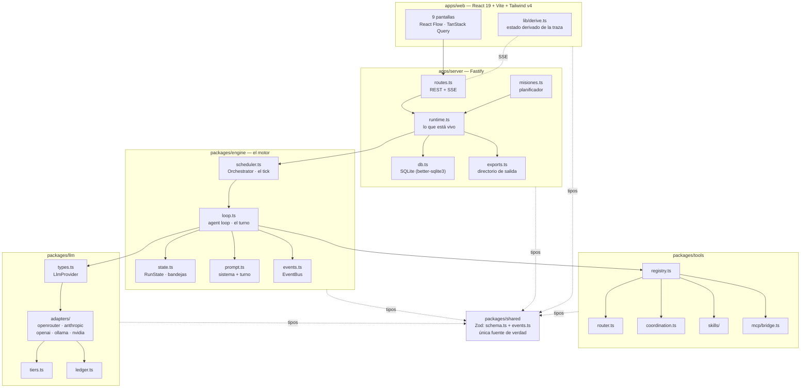
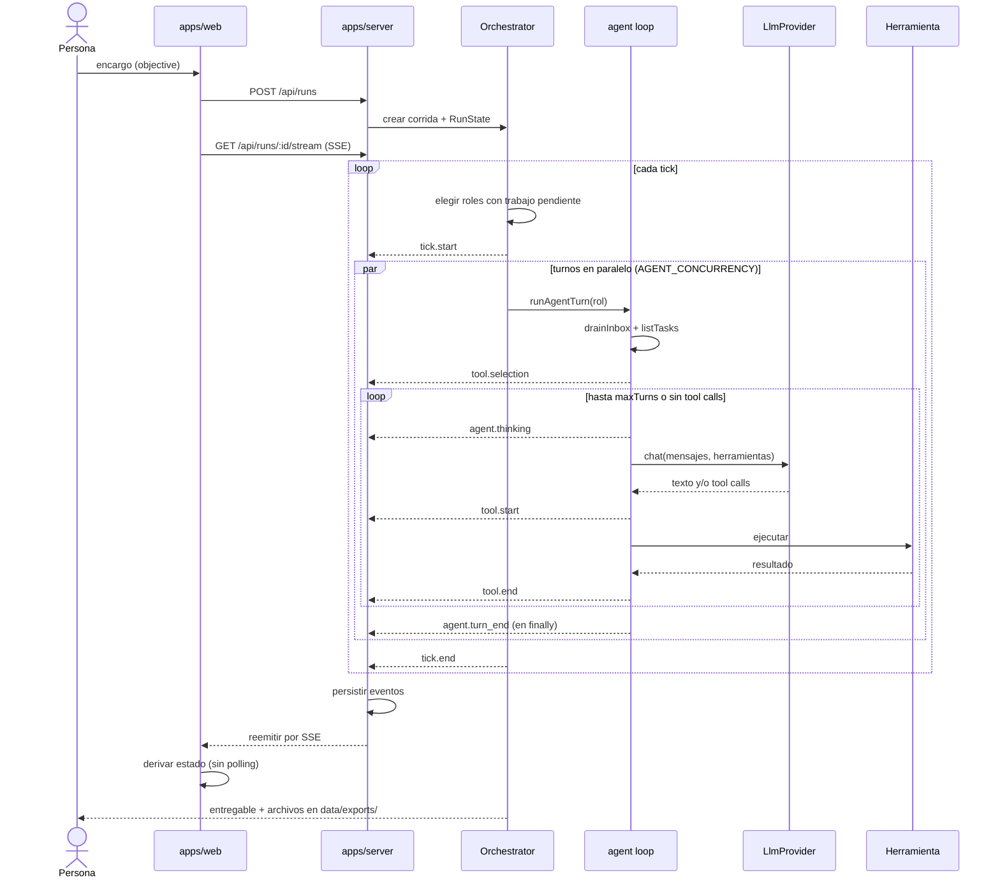
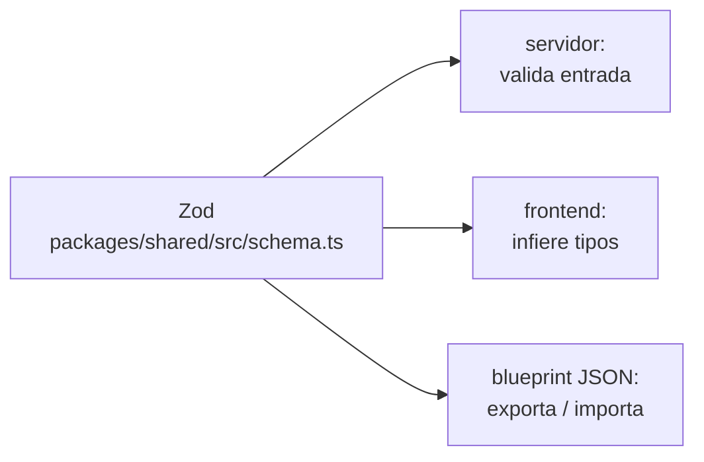

# Arquitectura general

## Vista de capas

La flecha que **no** existe es la importante: `packages/engine` no depende de
Fastify ni de SQLite. Recibe `LlmProvider` y `Persistence` inyectados, y por eso
los tests corren con `FakeProvider` y `noPersistence`, sin gastar tokens ni tocar
disco. Ver [[Invariantes de arquitectura]].

## Flujo completo de una corrida

## Los cinco paquetes

| Paquete | Responsabilidad | Detalle |
|---|---|---|
| `packages/shared` | modelo de dominio en Zod + catálogo de eventos | [[Modelo de dominio]], [[Referencia de eventos]] |
| `packages/llm` | interfaz `LlmProvider`, adaptadores, tiers, ledger | [[Capa LLM y tiers]] |
| `packages/tools` | registro de herramientas, puente MCP, tool router, habilidades | [[Herramientas y tool router]] |
| `packages/engine` | agent loop, estado de corrida, scheduler, bus de eventos | [[Motor de agentes]], [[Scheduler y ciclo de una corrida]] |
| `apps/server` | Fastify: REST + SSE + SQLite + directorio de salida + misiones | [[API HTTP y SSE]], [[Persistencia y esquema SQL]] |
| `apps/web` | React 19 + Vite + Tailwind v4 + React Flow + TanStack Query | [[Frontend web]] |

Ver [[Mapa del monorepo]] para el detalle archivo por archivo.

## Los dos niveles de "lo que está vivo"

`apps/server/src/runtime.ts` sostiene dos cosas con vidas distintas:

- **Runtime de empresa** (`CompanyRuntime`): vive mientras el servidor esté
  arriba. Sostiene las conexiones MCP y el registro de herramientas — por eso el
  MCP Hub muestra servidores conectados aunque no haya ninguna corrida.
- **Corrida activa** (`ActiveRun`): efímera, se apoya en el runtime de empresa.
  No sobrevive a un reinicio.

> [!warning] `active.run` queda viejo
> El estado autoritativo de una corrida es `orchestrator.snapshot`, no
> `active.run`: este último no se actualiza al pausar o detener. Ver
> [[Trampas conocidas]].

## Frontera de datos

Un campo nuevo se agrega **primero** en `schema.ts`. Los dos lados infieren de
ahí, así que no hay un tipo de request duplicado que se pueda desincronizar.

## Enlaces

- [[Invariantes de arquitectura]] — las reglas que no se rompen
- [[Decisiones de arquitectura]] — por qué es así y no de otra forma
- [[Trampas conocidas]] — lo que ya salió mal
