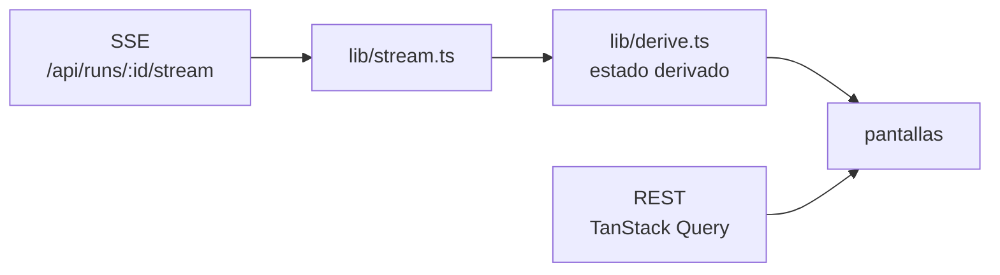

# Frontend web

`apps/web`. React 19 + Vite + Tailwind v4 + React Flow + TanStack Query.
Puerto `5173`, con `strictPort: true` para que no se corra de puerto en silencio.

## Las nueve pantallas

`apps/web/src/App.tsx` define las pestañas y el selector de empresa.

| Pestaña | Archivo | Qué muestra |
|---|---|---|
| **Proyectos** | `routes/Proyectos.tsx` | **la puerta de entrada**: una ficha por proyecto, con crear, abrir y borrar |
| **Proceso en vivo** | `routes/LiveProcess.tsx` | el organigrama animado, el feed de actividad, los hilos, el tablero, los entregables, las aprobaciones y el **timeline con replay** |
| **Tablero** | `routes/Board.tsx` | las tareas por estado |
| **MCP Hub** | `routes/McpHub.tsx` | semáforos, matriz "quién usa qué", probador manual |
| **Solicitudes** | `routes/Requests.tsx` | lo que los agentes le piden a la persona |
| **Empresa** | `routes/Settings.tsx` → `CompanyDesigner` | departamentos, roles, políticas, herramientas, misiones, y **Mantenimiento** al pie |
| **Salida** | `routes/Output.tsx` | el directorio de archivos, la vista previa y el botón de **publicar** |
| **Memoria** | `routes/Memory.tsx` | lecciones, sembrar y corregir |
| **Costos** | `routes/Settings.tsx` → `Costs` | el ledger |
| **Proveedores** | `routes/Settings.tsx` → `Providers` | qué modelo resuelve cada tier, con el motivo |

## Proyectos: por qué existe

Un **proyecto** es una empresa completa. El rótulo cambia sólo en esta pantalla:
adentro se sigue hablando de empresa, agentes y departamentos, que es la
metáfora sobre la que está armado el producto, y el dominio sigue siendo
`Company`. Ver [[Gestión de proyectos]].

Es la **primera pestaña y la pantalla inicial**: con más de una empresa cargada,
lo primero que hay que decidir es con cuál se trabaja. Antes eso vivía sólo en un
`<select>` del encabezado, y crear un proyecto no se podía sin llamar a la API.

Dos reglas de navegación que salieron de romperlo:

- **`SIN_PROYECTO`**: Proyectos y Proveedores no exigen uno elegido. Sin esa
  excepción, una instalación nueva es un callejón sin salida — la pantalla donde
  se crea el primer proyecto pediría un proyecto. El resto de las pestañas se
  deshabilitan con un `title` que explica por qué.
- **`company.isError` no es `isLoading`.** Un proyecto borrado desde otra pestaña
  deja la consulta en error; sin distinguirlas, la pantalla decía "Cargando…"
  para siempre.

El `<select>` del encabezado queda para alternar rápido entre dos proyectos sin
volver a la pantalla; la gestión vive en Proyectos.

## Las dos que importan

### Proceso en vivo
El organigrama es el escenario: los nodos pulsan mientras el agente piensa y
muestran qué herramienta está ejecutando; las aristas se animan cuando un mensaje
viaja. Abajo, un timeline que retrocede y **reproduce la corrida** desde la traza
guardada. Podés inyectarle un mensaje a cualquier agente en cualquier momento.

### MCP Hub
Ver [[Integración MCP]].

### Mantenimiento
Arranca **cerrado**: son las únicas acciones de esa pantalla que destruyen
trabajo y ninguna es reversible. Cada una dice antes qué se lleva y qué no, y el
diagnóstico sólo se consulta con la sección abierta —recorre el disco entero, y
no tiene por qué correr cada vez que alguien edita un agente—. Ver
[[Limpieza y mantenimiento]].

## El estado se deriva, no se pide

La UI **no hace polling**. `lib/derive.ts` reconstruye mensajes, tareas,
entregables, costo, historial de tareas y quién habló con quién a partir de la
traza. Por eso "ver en vivo" y "retroceder en el timeline" son la misma
operación con un corte distinto.

`lib/acciones.ts` traduce cada evento a una descripción legible de lo que el
agente está haciendo — la actividad se lee como **una sola traza, con niveles y
en castellano**, y con lo último arriba.

## Trampas de la UI

> [!danger] Los nodos del organigrama se actualizan, no se rearman
> React Flow los deja en `visibility: hidden` hasta medirlos; si en cada render
> recibe objetos nuevos, pierde la medición y vuelve a empezar. Con la traza
> llegando por SSE nunca terminaba y **el grafo quedaba invisible** — nodos en el
> DOM, ninguno en pantalla. `OrgGraph` reusa el objeto anterior con
> `useNodesState`.

> [!warning] Los roles nuevos nacen en (0,0)
> Y se apilarían en el organigrama. `OrgGraph.autoLayout` los acomoda por
> jerarquía cuando detecta posiciones repetidas, y **respeta las que moviste a
> mano**.

> [!warning] `min-w-0` en grillas CSS
> En `Panel` y en las columnas: sin eso, `min-width: auto` desborda la página a
> lo ancho.

> [!danger] El header de `content-type`
> `api.ts` sólo pone `application/json` cuando hay cuerpo. Fastify responde 400
> ante un body vacío con ese header, y **todos los DELETE se rompen**.

## Vista previa de la salida

Ver [[API HTTP y SSE]]: el PDF y las imágenes se dibujan con `?inline`, el Word
se convierte a texto en el servidor, y el deck `.html` va en un iframe con
`sandbox` vacío.

El video y el audio se reproducen en la pantalla de Salida. El borrado desde la
UI **no pasa por las reglas de jerarquía** de los agentes: ahí decidís vos, con
confirmación y sin papelera.

## Enlaces

- [[Observabilidad y trazas]] — de dónde sale el estado
- [[API HTTP y SSE]] — el contrato
- [[Trampas conocidas]]
