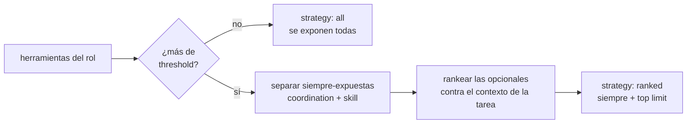

# Herramientas y tool router

`packages/tools/src/registry.ts` y `router.ts`.

## Los cuatro orígenes

Conviven con la misma forma (`RegisteredTool`), pero no con las mismas reglas:

| Origen | Qué agrupa | ¿Se asigna por `toolIds`? | ¿Compite en el ranking? |
|---|---|---|---|
| `coordination` | cómo los agentes se hablan entre sí | **no**, se otorgan siempre | no |
| `skill` | lo que un rol sabe **producir** | sí | no |
| `capability` | `web_search`, `fetch_url` | sí | sí |
| `mcp` | descubiertas de un servidor MCP | sí | sí |

Las dos reglas parecen contradictorias y no lo son:

- **Coordinación siempre**: sin ellas el agente no puede responder, delegar ni
  escalar, y la empresa no existiría como tal.
- **Habilidad nunca sola**: `export_video` es una capacidad del rol, igual que en
  una empresa real. Si armás una empresa por código y no registrás las
  habilidades en la tabla `tools`, vas a ver a un agente explicando que no
  encuentra la herramienta.

Ver [[Catálogo de herramientas]] para la lista completa.

## `ToolRegistry`

```ts
new ToolRegistry()                    // arranca con coordination + capability
registry.register(tool)               // agrega una (skills, MCP)
registry.unregisterByMcpServer(id)    // al desconectar o recargar un servidor
registry.forRole(role, configuredTools)
registry.describe()                   // metadatos para persistir y para la UI
```

`forRole` devuelve: **todas** las de coordinación, más las que `role.toolIds`
asignó explícitamente.

## El router

`selectTools(available, taskContext, options)`.

Con dos o tres MCP conectados el catálogo llega a decenas de tools. Pasarlas
todas en cada turno cuesta contexto y degrada la elección del modelo, así que
**por encima del umbral se acota el set por relevancia contra la tarea**.

| Opción | Por defecto | Qué es |
|---|---|---|
| `threshold` | 25 | por debajo de esto se exponen todas: rankear no aporta y puede equivocarse |
| `limit` | 12 | cuántas **opcionales** se exponen al rankear |

> [!danger] `limit` no es el total
> Las que van siempre no compiten por esos lugares. Contarlas dentro del límite
> dejaba **5 lugares para 20 herramientas**, y un desarrollador al que se le pidió
> exportar un PDF no tenía `export_pdf` en su lista — y respondía, con razón, que
> no la tenía.



## La decisión no queda oculta

`selectTools` devuelve `{ tools, candidates, exposed, strategy, reason }` y el
motor lo emite como evento **`tool.selection`**, antes de la llamada al modelo.
La UI lo muestra como *"por qué tenía esta herramienta a mano"*.

Es la diferencia entre un filtro y una caja negra: si un agente no usó la
herramienta que esperabas, podés ver si siquiera la tuvo. Ver
[[Observabilidad y trazas]].

## Ejecución de una herramienta

El contrato está en `packages/tools/src/types.ts`:

```ts
interface RegisteredTool {
  name; origin; description; inputSchema;
  mcpServerId; requiresApproval; readOnly;
  execute(args, ctx: ToolContext): Promise<ToolResult>;
}
```

- `readOnly: true` = sin efectos secundarios; el motor puede ejecutarlas en
  paralelo.
- `requiresApproval: true` = **no se ejecuta**: abre una `ApprovalRequest` y esa
  rama del trabajo queda detenida hasta que alguien resuelva.
- El resultado se construye con `ok(mensaje, ref?)` o `fail(motivo)`. El texto de
  error importa tanto como el camino feliz: **es lo único que el agente puede
  leer para corregirse**. Un "no existe" a secas hace que vuelva a intentar con
  la misma clave inventada; por eso `buscarEntregable` explica qué claves sí
  existen.

### `inputSchema` y el memo de lecturas

Cuando el esquema cierra con `additionalProperties: false`, la huella del memo se
calcula **sólo sobre lo declarado**. Ver el caso de los 534k tokens en
[[Motor de agentes]].

## Enlaces

- [[Catálogo de herramientas]] — la lista completa
- [[Coordinación entre agentes]] — las de `coordination`
- [[Habilidades de producción]] — las de `skill`
- [[Integración MCP]] — las de `mcp`
- [[Cómo agregar una herramienta]]
