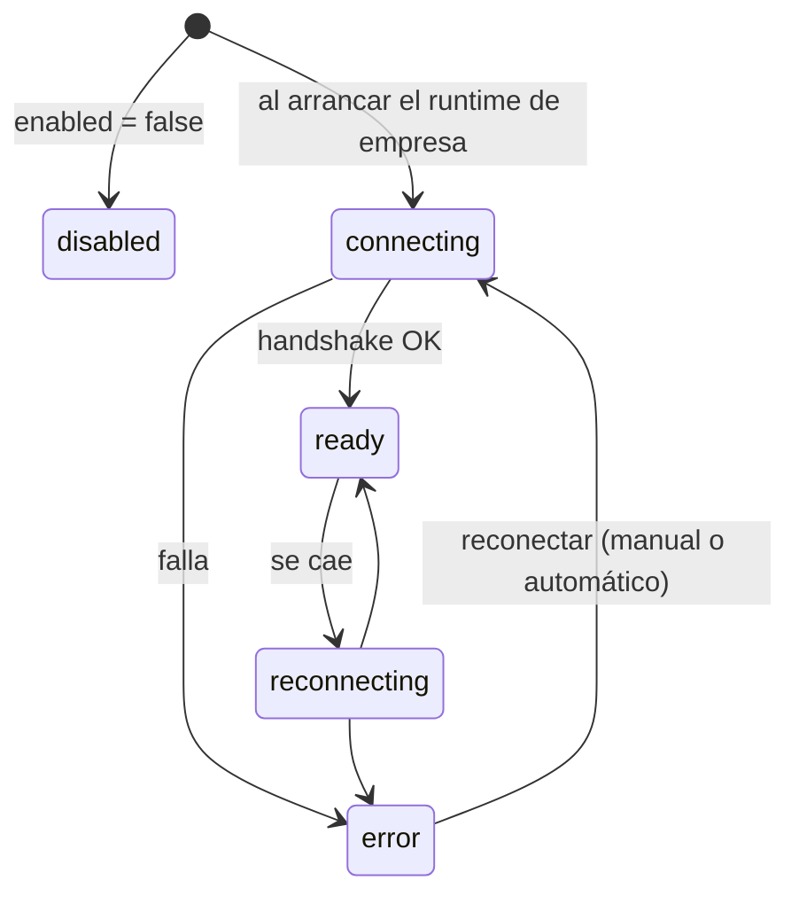

# Integración MCP

`packages/tools/src/mcp/bridge.ts` → `McpBridge`. Es cómo entra al sistema todo
lo que no está construido adentro: filesystem, memoria, APIs de terceros.

## El principio

> Los agentes **no** tienen acceso directo a filesystem ni a shell. Eso entra por
> MCP, y queda visible en el Hub como cualquier otra conexión.

Un servidor MCP conectado aporta sus herramientas al catálogo, nombradas
`mcp__<servidor>__<tool>`. El segmento `<servidor>` es el campo `name` del
`McpServer`, restringido por Zod a minúsculas, números, guiones y guiones bajos.

## Dos transportes

### `stdio`
```ts
{ type: "stdio", command, args, envRefs, cwd }
```

### `http`
```ts
{ type: "http", url, headerRefs, caPath }
```

`caPath` es la ruta a la CA que firma el certificado del servidor, para los que
corren en la máquina con certificado propio (`mcp/ca-fetch.ts`). **No es un
secreto —es una ruta— y sirve para verificar, no para saltear la verificación.**

## Los secretos van por referencia

`envRefs` y `headerRefs` guardan el **nombre** de la variable de entorno, no el
valor:

```jsonc
{ "GITHUB_TOKEN": "GITHUB_TOKEN" }   // ← el valor sale de process.env al conectar
```

Los secretos nunca se guardan en la base ni viajan a la UI, y **una empresa
exportada a JSON no lleva credenciales adentro**. `apps/server/src/env.ts` →
`resolveSecret` es quien los resuelve. Mantené esa regla al agregar campos de
configuración MCP. Ver [[Seguridad]].

## Ciclo de vida de una conexión



El estado vive en `McpServerHealth`, que es lo que pinta el Hub:

| Campo | Qué muestra |
|---|---|
| `status` | el semáforo |
| `handshakeMs` | latencia del handshake |
| `toolCount` | herramientas descubiertas |
| `invocations` · `errors` · `lastError` · `lastInvokedAt` | telemetría de uso |
| `connectedAt` · `reconnectAttempts` | se resetea al conectar |

Cada cambio emite un evento **`mcp.status`**, que se reemite por el canal SSE
global `GET /api/mcp/stream` — global y no por corrida, porque las conexiones
viven mientras el servidor esté arriba, aunque no haya ninguna corrida.

## `autoApproveTools`

Por defecto `true`: las tools descubiertas quedan aprobadas al descubrirlas. Con
`false`, cada una requiere aprobación explícita antes de ejecutarse.

## El MCP Hub

Pantalla dedicada (`apps/web/src/routes/McpHub.tsx`) con:

- **Semáforo por servidor** con latencia, herramientas, invocaciones y errores.
- **Matriz "Quién usa qué"**, que es también el **editor de accesos**: un clic le
  da o le quita a un agente todas las herramientas de un servidor.
- **Probador manual** (`POST /api/companies/:companyId/mcp/probe`): ejecutar una
  tool y ver qué devuelve **sin arrancar la empresa**. Es la forma más barata de
  descartar que el problema sea del servidor MCP y no del agente.
- **Reconectar** (`POST /api/companies/:companyId/mcp/:serverId/reconnect`).

## El aviso de seguridad de `@hono/node-server`

`npm audit` reporta `GHSA-frvp-7c67-39w9`, arrastrado por
`@modelcontextprotocol/sdk`. **No es alcanzable**: el SDK sólo referencia hono
desde su lado servidor, y este proyecto importa exclusivamente el lado cliente
(`client/index`, `client/stdio`, `client/streamableHttp`) — verificado con grep
sobre el paquete instalado. No se aplica un override porque la corrección está en
la línea 2.x y el SDK depende de `^1.x`.

La nota completa está en `package.json → auditNotes`. **No lo "arregles" sin leer
esa nota.**

## Trampa conocida

Una ruta MCP fuera del directorio permitido produce un error que el modelo no
puede resolver, y sin el corte por repetición le come las `maxTurns` enteras.
Ver [[Motor de agentes]].

## Enlaces

- [[Herramientas y tool router]] — cómo compiten las tools de MCP por los lugares
- [[Seguridad]]
- [[CU-05 Conectar un servidor MCP]]
