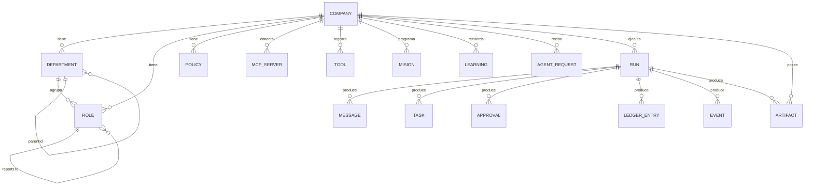

# Modelo de dominio

Todo el dominio vive en `packages/shared/src/schema.ts`, en Zod. El servidor
valida contra estos esquemas y el frontend infiere sus tipos de ahí. Ver
[[ADR-002 Zod como única fuente de verdad]].

## Diagrama de entidades

> [!important] La línea doble de `ARTIFACT`
> Un entregable pertenece a la **corrida** que lo produjo y a la **empresa**.
> Borrar la corrida se lleva mensajes, tareas, aprobaciones, ledger y eventos —
> el registro de *cómo* se llegó — pero nunca el entregable. Ver
> [[Invariantes de arquitectura]] §12.

---

## Configuración: lo que definís antes de correr

### `Company`
La unidad de configuración. Campos que importan:

| Campo | Para qué |
|---|---|
| `mission` | qué hace la empresa, en una frase |
| `context` | contexto de negocio que **todos** los agentes reciben en su prompt (hasta 20k caracteres) |
| `budgetUsd` | tope de gasto por corrida en USD; el motor aborta al superarlo |
| `defaultModel` | `ModelSelection` que heredan los roles que no fijan el suyo |
| `voz` | cómo suena la marca: `unaSolaVoz` y `pronunciacion`. Ver [[Música y narración]] |
| `currency` | ISO de 3 letras |

### `Department`
Nombre, propósito, `parentId` (el organigrama es un árbol) y `position` en el
canvas — que es **sólo presentación**.

### `Role` — un rol es un agente

| Campo | Para qué |
|---|---|
| `systemPrompt` | instrucciones específicas; se compone con el contexto de empresa |
| `model` | `ModelSelection` propia: proveedor, slug o tier, temperatura, `maxOutputTokens` |
| `toolIds` | herramientas asignadas. **No** controla las de coordinación, que se otorgan siempre |
| `authority` | `executor` \| `manager` \| `executive` |
| `reportsTo` | a quién escala; `null` = tope de la jerarquía |
| `maxTurns` | iteraciones máximas del agent loop **dentro de un turno** (1–50, por defecto 8) |
| `spendApprovalThresholdUsd` | monto por encima del cual debe pedir aprobación |

Los tres niveles de `authority` no son decorativos: determinan qué puede
delegar, a quién puede escalar y **qué puede borrar** del directorio de salida.
Ver [[Coordinación entre agentes]] y [[Habilidades de producción]].

### `Policy`
El `statement` va al prompt de los roles alcanzados (`appliesToRoleIds` vacío =
toda la empresa). El `gate` opcional (`{ type: "spend_above", amountUsd,
requiresRoleId }`) se evalúa **en código** antes de dejar pasar una acción — un
agente puede ignorar un texto, no un ejecutor.

### `Tool` y `McpServer`
Ver [[Catálogo de herramientas]] e [[Integración MCP]]. Dos detalles del
esquema:

- `toolOrigin` = `coordination` | `capability` | `skill` | `mcp`.
- `mcpTransport` es una unión discriminada `stdio` | `http`, y los secretos
  viajan como **`envRefs` / `headerRefs`**: el nombre de la variable, nunca el
  valor. Ver [[Seguridad]].

### `Mision`
La receta de una corrida más cuándo repetirla. Ver [[Misiones programadas]].

### `CompanyBlueprint`
La empresa entera como un JSON de `version: 1`: empresa, departamentos, roles,
políticas, servidores MCP y herramientas **built-in** (las de MCP se
redescubren al conectar). Se exporta por
`GET /api/companies/:id/blueprint` y se importa por
`POST /api/companies/import`. Sin credenciales adentro.

---

## Ejecución: lo que pasa mientras corre

### `Run`

`status` ∈ `idle` · `running` · `paused` · `awaiting_approval` · `completed` ·
`stopped` · `budget_exceeded` · `failed`.
`mode` ∈ `manual` · `continuous` · `cron`.

Además: `objective` (el encargo), `tick`, `maxTicks`, `budgetUsd`, `spentUsd`,
`cronIntervalMs` y `stopReason` — que es lo que la UI muestra cuando algo se
detiene. Ver [[Scheduler y ciclo de una corrida]].

### `Message`

Nueve tipos: `request`, `response`, `report`, `escalation`, `approval_request`,
`approval_grant`, `approval_deny`, `broadcast` y `human` (inyectado por la
persona desde la UI). Cuatro estados: `pending` → `delivered` → `read` →
`answered`. `threadId` agrupa la conversación; un `request` abre hilo y su
respuesta lo comparte.

> [!tip] `human` importa más de lo que parece
> El encargo que se inyecta desde la UI es de tipo `human`. Cuando `reply` exigía
> `request` o `escalation`, **nadie podía contestarle a la persona**: en una
> corrida real se comió 14 de 25 llamadas a `reply`.

### `Task`

Seis estados: `pending` → `in_progress` → `in_review` → `done`, más `blocked` y
`cancelled`. `in_review` existe para que el paso por control de calidad sea una
etapa **visible**: sin ella un entregable saltaba de "en curso" a "hecha" y nadie
podía ver si alguien lo había verificado. Cuatro prioridades y un `dueTick`.

### `Artifact`

`key` + `version` + `content` (hasta 500k caracteres) + `contentType`
(`markdown` | `json` | `text`) + `authorRoleId`. Es lo que reciben las
habilidades por clave. Ver [[Habilidades de producción]].

### `ApprovalRequest` vs `AgentRequest`

Dos bandejas distintas, a propósito:

| | `ApprovalRequest` | `AgentRequest` |
|---|---|---|
| Quién resuelve | otro **rol** con autoridad, o la persona | **siempre** la persona |
| Qué pide | dejar pasar una acción bloqueada (`requiresApproval`) | `create_role`, `context`, `tool_access` |
| Alcance | la corrida | la **empresa** (sobrevive a la corrida) |
| Pantalla | Proceso en vivo | Solicitudes |

> [!warning] Una pregunta se contesta con una respuesta, no con un permiso
> Antes toda resolución de `request_context` salía como `approval_grant` con el
> asunto "Tu solicitud fue aprobada": el agente veía "Aprobación concedida" y el
> dato pedido quedaba escondido en el cuerpo. Se midió volviendo a preguntar lo
> mismo al ciclo siguiente. Ver [[Trampas conocidas]].

### `Learning`
Vive a nivel **empresa** y sobrevive a la corrida. Ver [[Memoria de la empresa]].

### `LedgerEntry`
Tokens de entrada, de salida y **cacheados**, costo en USD y latencia, por
llamada. Ver [[Costos y presupuesto]].

---

## Enlaces

- [[Referencia de esquemas]] — la tabla campo por campo
- [[Persistencia y esquema SQL]] — cómo se guarda
- [[Empresas de ejemplo]] — el dominio instanciado
