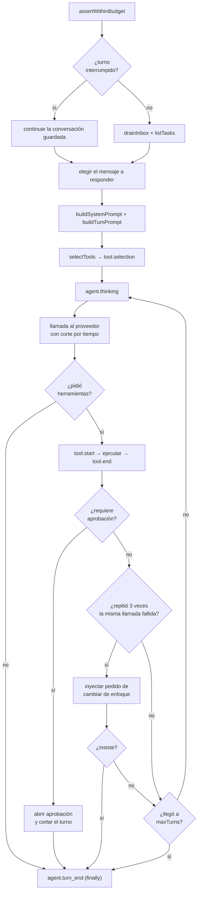

# Motor de agentes

`packages/engine/src/loop.ts` → `runAgentTurn(state, role, deps)`.
Un **turno** es lo que hace un rol dentro de un [[Scheduler y ciclo de una corrida|tick]].

> Cada paso emite un evento **antes** de ejecutarse, no después de terminar, para
> que la UI muestre lo que está pasando y no un resumen a posteriori.

## El ciclo



## Lo que entra en un turno

### El prompt de sistema (`prompt.ts` → `buildSystemPrompt`)
Contexto de negocio de la empresa, prompt del rol, políticas que lo alcanzan,
su lugar en la jerarquía (a quién reporta, quién le reporta) y **la memoria de la
empresa** — hasta 25 lecciones, las más reafirmadas primero. La memoria va en el
prompt y no detrás de una herramienta a propósito: detrás de una tool el agente
gastaría un turno en descubrirla, otro en llamarla, y muchas veces no la
llamaría. Ver [[Memoria de la empresa]].

### El prompt de turno (`buildTurnPrompt`)
La bandeja de entrada drenada, las tareas abiertas, **la fecha de hoy** y la
presión de cierre.

> [!danger] Los agentes no tienen reloj
> `TurnDeps.fechaHoy` entra **formateada desde el llamador**. Sin eso un auditor
> marcó como typo una fecha correcta y pidió cambiarla a un año anterior; el
> corrector le hizo caso y **corrompió el dato**. Un verificador que no puede
> verificar inventa hallazgos, y sus falsos positivos se propagan aguas abajo con
> la misma autoridad que los reales.

### El mensaje a responder
El turno responde al **primer pedido pendiente** de la bandeja; el resto queda
como contexto. Si no hay un pedido formal, se contesta el primer mensaje que
haya — incluido el de tipo `human`, que es el encargo que inyecta la persona.

## Presión de cierre

Cada turno recibe cuánto queda de ciclos y de presupuesto. Tres tramos:

| Tramo | Qué se le dice |
|---|---|
| sobre la mitad | nada |
| poco margen | dejá de abrir pedidos nuevos |
| al final | producí el entregable con `write_artifact` **aunque esté incompleto**, dejando explícito qué falta |

**Manda el más apremiante de los dos límites**: da igual que sobren ciclos si no
queda presupuesto para ejecutarlos.

Sin esto, los agentes se piden información entre sí hasta que la corrida muere
por presupuesto sin haber producido nada.

## Los cinco cortes

Cada uno está por un problema medido, no por precaución.

### 1. Presupuesto
`ledger.assertWithinBudget()` al empezar el turno; lanza `BudgetExceededError`.
Ver [[Costos y presupuesto]].

### 2. Tiempo de respuesta del proveedor
`TurnDeps.llmTimeoutMs`. Se midió una llamada de **649 segundos** que dejó a los
otros tres agentes esperando once minutos: el ciclo avanza cuando terminan
todos, así que el más lento manda.

### 3. Repetición de una llamada fallida
A la tercera vez con la misma herramienta y los mismos argumentos se le inyecta
un mensaje pidiéndole que cambie de enfoque; si insiste, se termina el turno.
Sin eso, un error que el modelo no puede resolver —una ruta MCP fuera del
directorio permitido— le come las `maxTurns` enteras.

### 4. `maxTurns`
Iteraciones máximas por turno, configurables por rol (por defecto 8).

### 5. Aprobación
Una herramienta con `requiresApproval` no se ejecuta: abre una
`ApprovalRequest` y esa rama del trabajo queda detenida.

## Turnos interrumpidos

`state.tomarTurnoInterrumpido(role.id)`: si un turno quedó cortado a la mitad,
se **continúa**, no se reempieza. La conversación guardada ya tiene la bandeja
leída, las fuentes consultadas y los resultados de las herramientas que sí
funcionaron — reempezar los pagaría de nuevo.

## El memo de lecturas

`read_artifact` sobre el mismo entregable no vuelve a inyectar el contenido:
devuelve un puntero.

> [!danger] Un argumento inventado derrota al memo
> El modelo cree que puede paginar y llama `read_artifact` con `start=4000`,
> `start=8000`… La herramienta no declara ese campo, lo ignora y devuelve el
> documento **entero** cada vez. Como la huella se calculaba sobre *todos* los
> argumentos, cada llamada parecía nueva: el mismo texto de 40k caracteres entró
> once veces al contexto y la corrida gastó **534k tokens de entrada para 2k de
> salida** (259:1).
>
> La huella ahora se calcula sólo sobre lo que el esquema declara cuando cierra
> con `additionalProperties: false`. Ahorrar el viaje al servidor no servía de
> nada: el costo está en los tokens que se reenvían en cada iteración.

## Registro de actividad

`RunState.activity` graba **cada** llamada a herramienta con su resultado real —
lo graba el agent loop, no el agente. Se conservan las últimas 500 entradas y se
exponen por `check_activity`, filtrable por rol.

Es lo único que detecta la clase de error más repetida: **ejecutar algo con éxito
y después informar que no se pudo**. Ver [[Coordinación entre agentes]].

## `TurnResult`

```ts
{ iterations, costUsd, summary, awaitingApproval, herramientas }
```

`herramientas` no es telemetría: el scheduler lo usa para dejar de convocar a
quien habla y no ejecuta nada. Ver [[Scheduler y ciclo de una corrida]].

## Enlaces

- [[Scheduler y ciclo de una corrida]] — quién llama a esto y cuándo
- [[Herramientas y tool router]] — qué herramientas ve el agente
- [[Capa LLM y tiers]] — con qué modelo piensa
- [[Observabilidad y trazas]] — qué emite cada paso
