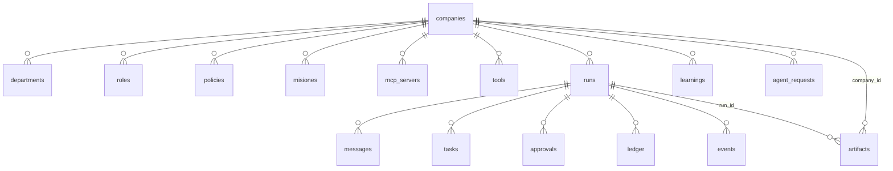

# Persistencia y esquema SQL

`apps/server/src/db.ts` → `Store`. SQLite vía `better-sqlite3`, síncrono.

## Sin migraciones versionadas

El esquema es **idempotente** (`CREATE TABLE IF NOT EXISTS`) y lo aplica el
constructor de `Store`. `npm run db:migrate` sirve para crear o inspeccionar la
base sin levantar el servidor: aplica el esquema y lista las tablas con sus
filas.

Si algún día hace falta una migración de verdad, entra en
`apps/server/src/migrate.ts`, que hoy está reservado para eso.

## Las quince tablas

### Configuración
`companies` · `departments` · `roles` · `policies` · `misiones` ·
`mcp_servers` · `tools`

### Ejecución
`runs` · `messages` · `tasks` · `approvals` · `ledger` · `events`

### Transversales a la corrida
`artifacts` · `learnings` · `agent_requests`

## `artifacts` tiene dos padres

`artifacts.run_id` **y** `artifacts.company_id`, con
`idx_artifacts_company`. Es el único caso, y está a propósito:

- `listArtifactsByCompany` filtra por `company_id` en vez de unir con `runs`.
- `deleteRun` se lleva eventos, mensajes, tareas, aprobaciones y ledger — el
  registro de *cómo* se llegó — pero **nunca los artefactos**.

> Limpiar la lista de corridas no puede costarle a la empresa el trabajo que
> produjo.

Al arrancar una corrida se cargan los entregables de corridas anteriores, así una
área lee lo que otra escribió y lo **versiona** en vez de reiniciar en v1. Los
previos no se re-persisten, y `list_artifacts` los marca como de otro trabajo.

## Índices

Todos los `company_id` y `run_id` están indexados. Dos con orden:

- `idx_runs_company ON runs(company_id, started_at DESC)` — la lista de corridas
  sale ordenada sin ordenar en memoria.
- `idx_events_run ON events(run_id, seq)` — **`seq` es lo que hace posible el
  replay**: los eventos se leen en el orden exacto en que ocurrieron.

## `deleteCompany`

Borra la empresa y, con ella, sus corridas y artefactos asociados. Es la única
operación que se lleva entregables, y lo hace porque no queda quién los posea.

Desde la API va envuelto en `Runtime.eliminarEmpresa`, que además suelta las
conexiones MCP y borra la carpeta de salida. Ver [[Limpieza y mantenimiento]].

## Las dos listas de tablas

`TABLAS_POR_EMPRESA` y `TABLAS_POR_CORRIDA` están definidas una sola vez y las
usan **tanto el borrado en cascada como el barrido de residuos**.

> Si aparece una tabla nueva y se agrega en un solo lado, el borrado deja basura
> que el barrido no ve — o al revés, el barrido se lleva filas que sí tenían
> dueño.

`artifacts` va en la lista **por empresa** a propósito: sobrevive a su corrida,
no a su empresa. `runs` no está en ninguna de las dos porque su cascada se hace a
mano (hay que borrar las filas de cada corrida antes que la corrida), pero
`residuos()` la cuenta aparte para no subdeclarar lo que va a borrar.

## Residuos y compactación

`residuos()` cuenta filas que apuntan a algo inexistente; `purgarResiduos()` las
borra; `vacuum()` compacta el archivo; `pesoEnDisco()` lo mide con
`pragma_page_count`. Detalle en [[Limpieza y mantenimiento]].

## El directorio de salida no es la base

Los archivos reales (Word, PDF, video, deck, imágenes) **no** viven en SQLite:
viven en `data/exports/<empresa>/` y los administra `ExportStore`
(`apps/server/src/exports.ts`).

| Responsabilidad | Cómo |
|---|---|
| Saneo de rutas | `safePath` limpia **segmento por segmento**: toda ruta que propone un agente se escribe y se borra dentro del directorio de la empresa y en ningún otro lado |
| Consultar sin escribir | `pathFor` resuelve la ruta **sin crearla**; `dirFor` la crea. Medir con `dirFor` convierte cada consulta en una escritura — ver [[Limpieza y mantenimiento]] |
| Limpieza | `removeCompany`, `removeCarpeta`, `carpetasResiduales`, `vaciarGenerado`, `medirEmpresa` |
| Procedencia | `.orq-generado.json` (oculto) registra qué generó la empresa y qué trajo una persona. Si no existe, todo cuenta como externo: **falla seguro** |
| Tamaño sin cargar | `pesoDe` devuelve el peso de un archivo sin leer su contenido |
| Publicar | `publicar` mueve el archivo a `publicado/` |

Ver [[Habilidades de producción]] y [[Base de datos]].

## Lo que NO se persiste

| Cosa | Dónde vive | Consecuencia |
|---|---|---|
| Estado vivo de una corrida (`RunState`) | memoria | las corridas no sobreviven a un reinicio: podés reproducir una vieja, no continuarla |
| Conexiones MCP | memoria (`CompanyRuntime`) | se reconectan al arrancar |
| Secretos de MCP | `process.env` | por diseño; ver [[Seguridad]] |
| Catálogo de modelos | caché en memoria del adaptador | se refresca al reiniciar |

## Enlaces

- [[Modelo de dominio]] — qué significa cada tabla
- [[Base de datos]] — comandos y operación
- [[Observabilidad y trazas]] — cómo se usa la tabla `events`
