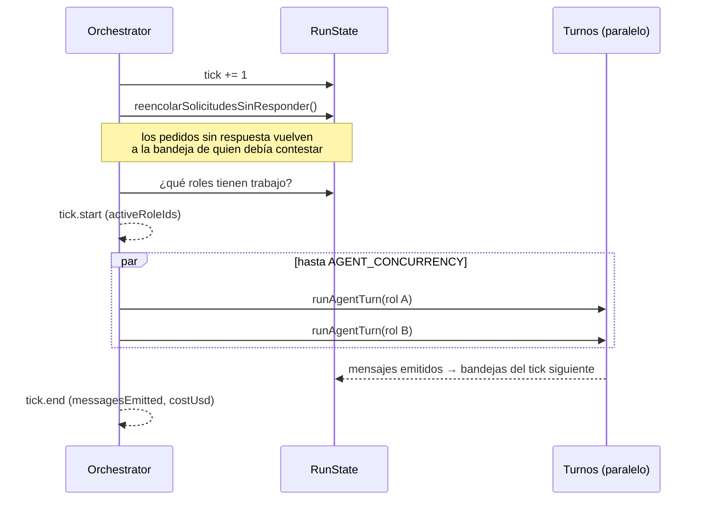
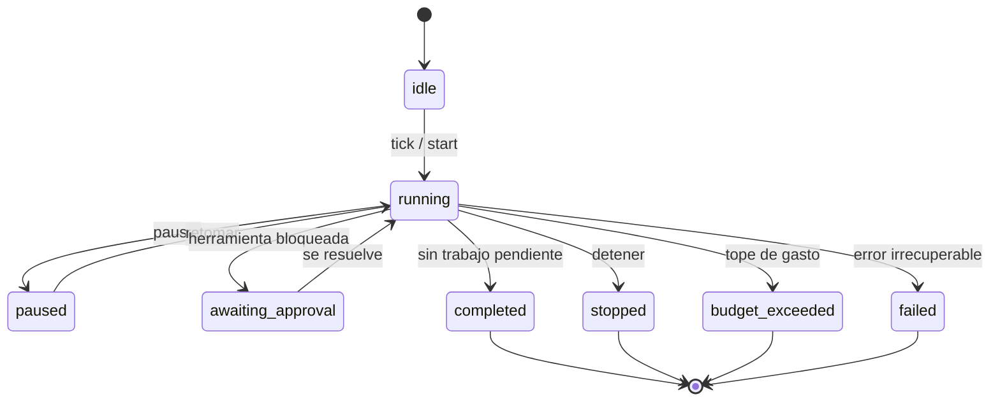

# Scheduler y ciclo de una corrida

`packages/engine/src/scheduler.ts` → `Orchestrator`. Es el motor de "la empresa
opera sola".

## Qué es un tick

> Un **tick** es un ciclo de la empresa: se toman los roles con trabajo
> pendiente, ejecutan su turno en paralelo acotado, y los mensajes que emiten
> entran a las bandejas **para el ciclo siguiente**.

Esa demora de un ciclo es deliberada: modela que nadie contesta en el mismo
instante en que le escriben, y evita que dos agentes entren en un ida y vuelta
infinito dentro del mismo tick.

## Los tres modos

| Modo | Comportamiento | Para qué |
|---|---|---|
| `manual` | un ciclo por click | observar paso a paso |
| `continuous` | ciclos encadenados hasta un corte | dejarla correr |
| `cron` | un ciclo cada `cronIntervalMs` | simular el ritmo de un negocio |

> [!warning] No confundir `mode: "cron"` con una misión
> `mode: "cron"` pacea los ciclos **dentro** de una corrida. Una
> [[Misiones programadas|misión]] es un encargo que **larga una corrida nueva**.

`tick()` es el modo manual y a la vez la unidad de los otros dos.

## Qué hace que un rol sea convocado

Un rol entra al tick si tiene **mensajes en la bandeja** o **tareas abiertas**.

> [!danger] Livelock por tarea abierta
> Un agente que habla y no ejecuta nada sigue teniendo la tarea abierta, así que
> vuelve a ser convocado el ciclo siguiente. Se midieron **catorce ciclos
> seguidos** así, hasta morir por límite de ciclos sin producir nada.
>
> El scheduler ahora cuenta las herramientas que ejecuta cada turno
> (`TurnResult.herramientas`) y **deja de convocar por tareas** a quien hace dos
> turnos vacíos seguidos. Un mensaje nuevo en la bandeja lo reactiva.

## Estados de la corrida

`Orchestrator.snapshot` es **el estado autoritativo**: compone el `Run` con el
status real, el tick de `RunState`, el gasto del ledger y el `stopReason`.

> [!warning] `active.run` queda viejo
> No se actualiza al pausar o detener. Leerlo hacía que una corrida ya detenida
> dijera "está en curso". Ver [[Trampas conocidas]].

## Reencolado de pedidos sin respuesta

Antes de decidir si queda trabajo, los pedidos que quedaron sin respuesta vuelven
a la bandeja de quien los debía contestar, y se emite un `log` de nivel `warn`
con cuántos fueron. Sin esto, un pedido perdido dejaba a quien preguntó esperando
para siempre.

## Destrabar `awaiting_approval`

`runContinuous` se destraba sola si el estado es `awaiting_approval` pero ya no
hay nada pendiente. Sin eso, retomar era un no-op.

Y hay un detalle que cuesta encontrar: **la corrida tiene su propia copia de las
solicitudes**. Resolver una por la API toca la base; hay que reflejarla también
en `RunState.resolverSolicitud`, o la corrida queda esperando para siempre una
respuesta que ya está dada.

## Concurrencia

`AGENT_CONCURRENCY` (por defecto 4) acota cuántos turnos corren en paralelo
dentro de un tick.

> [!danger] El actor no se guarda, se ata
> Con turnos en paralelo, un actor mutable en `RunState` hacía que un agente
> pisara al otro y los mensajes quedaran firmados por el rol equivocado. Se usa
> `RunState.forActor(actorId)`, que captura el actor en el closure. Test de
> regresión con 4 agentes concurrentes en `scheduler.test.ts`. Ver
> [[Invariantes de arquitectura]] §3.

## Controles desde la UI

Los botones se muestran **según el estado**: ofrecer "pausar" sobre una corrida
terminada obliga a adivinar cuál sirve. Cada botón dice qué hace y su `title`
explica cuándo conviene.

Sólo una corrida `running` no se puede borrar. Y al borrarla hay que soltarla del
runtime (`olvidarCorrida`), o queda un orquestador vivo escribiendo eventos de
algo que ya no existe.

## Enlaces

- [[Motor de agentes]] — qué pasa dentro de un turno
- [[Costos y presupuesto]] — el corte por presupuesto
- [[Misiones programadas]] — quién larga una corrida sola
- [[Observabilidad y trazas]] — `tick.start` y `tick.end`
