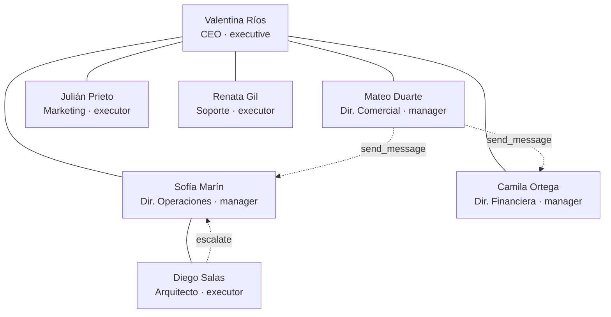

# Coordinación entre agentes

## El principio

> **No comparten contexto.** Cada rol tiene bandeja propia y sólo sabe lo que le
> escriben, igual que en una organización real.

Toda la coordinación pasa por herramientas. Y la jerarquía se valida **en
código**, no en el prompt: un agente puede ignorar una instrucción, pero no puede
saltearse el ejecutor de la herramienta.

(Es el organigrama de [[Empresas de ejemplo|Codytion S.A.]]. Las líneas llenas
son `reportsTo`; las punteadas, mensajería lateral.)

## Los tres niveles de autoridad

| Nivel | Qué decide | Qué puede borrar |
|---|---|---|
| `executive` | para toda la empresa | cualquier cosa |
| `manager` | dentro de su área; escala lo que cruza departamentos | sólo material de apoyo — no un `.docx` ni un `.pdf` |
| `executor` | ejecuta lo asignado; escala cualquier decisión | nada |

**Producir queda abierto** para los tres: un ejecutor tiene que poder trabajar
sin pedir permiso. Ver [[Habilidades de producción]].

## Las guardias que hicieron falta

Cada una salió de una corrida real medida.

### `send_message` rechaza insistirle a quien no contestó

> Sin la guardia, los agentes mandaban pedido, recordatorio, seguimiento y
> escalamiento sobre lo mismo — **diez mensajes a la misma persona en una
> corrida**. Y, peor, se quedaban esperando en vez de avanzar con lo que sí
> podían hacer solos.

Insistir no acelera a nadie.

### `assign_task` valida la jerarquía

Un ejecutor que intenta asignarle una tarea a su jefe recibe el error **y la
lista de su equipo real**. El mensaje de error importa: un rechazo sin
alternativa hace que el agente reintente.

Lo mismo con `puedeBorrar`: el rechazo **nombra a quién escalarle**, así el
agente sigue con `escalate` en vez de trabarse.

### `reply` acepta el mensaje `human`

> Antes se exigía `request` o `escalation`, y entonces **nadie podía contestarle
> a la persona**: el encargo que se inyecta desde la UI es de tipo `human`, así
> que `reply` devolvía "no hay ningún mensaje que responder". En una corrida real
> se comió **14 de 25 llamadas a `reply`** —el coordinador insistía en acusar
> recibo del encargo— y cada intento gastaba una iteración entera.

### `write_artifact` rechaza claves que son variantes

`-ciclo3`, `_v2`, `-final`, y sufijos colgados como `-detalle`: se le pide que
versione la original. **Los modelos baratos fragmentan el entregable si esa
guardia no está.**

## Auditar lo que un agente hizo, no lo que contó

`check_activity` expone `RunState.activity`: cada llamada a herramienta con su
resultado **real**, grabada por el agent loop y no por el agente. Filtrable por
rol, últimas 500 entradas.

Es lo único que detecta la clase de error más repetida: **ejecutar algo con éxito
y después informar que no se pudo**.

Combinado con acceso de lectura a las fuentes, un revisor contrasta cada
afirmación del entregable contra su origen y devuelve la corrección **con la
cita**, en vez de un "revisar el documento" que no acciona nada. Ver
[[CU-04 Control de calidad entre agentes]].

## El tick de retardo

Lo que un agente emite entra a las bandejas del **ciclo siguiente**. Modela que
nadie contesta en el mismo instante, y evita ida y vuelta infinito dentro de un
tick. Ver [[Scheduler y ciclo de una corrida]].

## Cuando el agente necesita a la persona

Tres herramientas abren una bandeja aparte (`AgentRequest`, pestaña
**Solicitudes**), porque tienen destinatario humano y requieren una **decisión**,
no una respuesta:

| Herramienta | Ejemplo |
|---|---|
| `request_new_role` | "necesito a alguien que se ocupe de X" — con una propuesta editable antes de aceptarla |
| `request_context` | "necesito saber el margen objetivo" |
| `request_tool_access` | "necesito `web_search`" |

> [!warning] Una pregunta se contesta con una respuesta
> Antes toda resolución de `request_context` salía como `approval_grant` con el
> asunto "Tu solicitud fue aprobada": el agente veía "Aprobación concedida" y el
> dato pedido quedaba escondido en el cuerpo. Se midió volviendo a preguntar lo
> mismo al ciclo siguiente.

> [!warning] Contestar una solicitud cuya corrida ya cerró
> No llega a ninguna bandeja: `runtime.notifyRequester` la guarda como
> `Learning` de la empresa, que sí entra en el prompt de las corridas siguientes.
> Ver [[Memoria de la empresa]].

## Enlaces

- [[Catálogo de herramientas]]
- [[Modelo de dominio]] — `Message`, `Task`, `ApprovalRequest`, `AgentRequest`
- [[Motor de agentes]]
