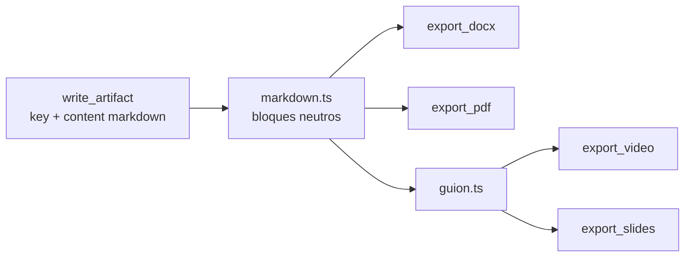
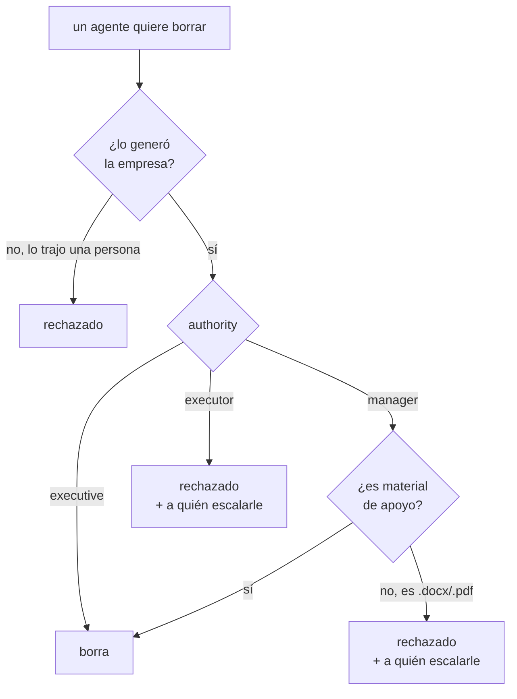

# Habilidades de producción

> Además de con quién habla y de dónde lee, un rol tiene **habilidades**: lo que
> sabe producir.

`packages/tools/src/skills/`. Se registran como origen `skill` para que se
asignen y se vean como cualquier otra herramienta, pero se distingan en la UI:
"puede entregar un Word" es una capacidad del rol, igual que en una empresa real.

## El flujo de dos pasos

El markdown se parsea **una sola vez** a bloques neutros y de ahí salen todas las
salidas. Por eso el Word, el PDF, el video y el deck no pueden decir cosas
distintas.

Ver [[ADR-005 Las habilidades trabajan sobre entregables ya escritos]] para por
qué reciben una clave y no el contenido.

## Documentos que alguien va a abrir

Los `.docx` y `.pdf` se arman para leerse, no para pasar una validación:

- portada con **quién firma**, compuesta por el sistema a partir de
  `DocumentMeta` — no la inventa el modelo;
- encabezado y pie con numeración;
- tablas con bordes y encabezado repetido;
- listas numeradas de verdad;
- control de huérfanos.

**La fecha entra formateada desde el llamador**: el render no tiene reloj, y así
los tests son deterministas.

### Tres trampas de pdfkit que costaron caro

| Trampa | Síntoma | Solución |
|---|---|---|
| escribir debajo del margen inferior **agrega una página** | el pie duplicaba el documento | bajar `page.margins.bottom` mientras se dibuja |
| en texto `continued`, la posición y el ancho van **sólo en el primer tramo** | cada negrita partía el párrafo | pasarlos una vez |
| las fuentes estándar usan WinAnsi | "✅ Sí" se imprimía "' Sí" | descartar emojis (`sinEmoji`) |

### Dos trampas de tablas

- Cada columna necesita un **ancho mínimo igual al de su palabra más larga**: sin
  eso, el reparto proporcional parte las palabras al medio.
- Una **línea en blanco entre grupos de filas no termina la tabla**: los agentes
  separan así los bloques, y cortar ahí dejaba media tabla maquetada y el resto
  como texto con pipes a la vista.

## `write_artifact` rechaza lo que no es un entregable

`revisarCalidad` bloquea:

- un título que habla del **proceso interno** — "Ciclo 2", "Bandeja de entrada";
- un **muro de más de 400 caracteres sin una sola sección**.

> El render maqueta lo que recibe, pero no puede inventar una estructura que no
> está. Se verifica **en la herramienta y no sólo en el prompt**: un agente puede
> ignorar una instrucción, no al ejecutor.

## El directorio de salida

`data/exports/<empresa>/`, en carpetas: la habilidad acepta `folder` y la crea
sola. Sobre ese directorio los agentes **crean, modifican y borran**:

| Herramienta | Qué hace |
|---|---|
| `write_output_file` | crear o reemplazar un archivo de texto |
| `list_output` | el árbol |
| `delete_files` | borrar; acepta `kind` (`multimedia` \| `documents` \| `all`) para un grupo entero |
| `export_*` | producir |

`delete_files` con `kind` existe porque **"borrá toda la multimedia" es una
llamada, no una por archivo**: encadenarlas hacía que el agente fallara a la
mitad.

### Un archivo por entregable y formato

`key.pdf`, no `key-v3.pdf`. La versión va en la portada, y al exportar se borran
los `key-vN.ext` que dejó la forma vieja.

## Permisos de borrado

Dos reglas independientes:

1. **Un agente sólo borra lo suyo** (`removeComoAgente`). La procedencia se
   registra en `.orq-generado.json` dentro del directorio de la empresa —oculto,
   el árbol ignora los que empiezan con punto— y se actualiza al escribir y al
   borrar. **Si el manifiesto no existe, todo cuenta como externo: falla
   seguro.**
2. **Borrar mira la jerarquía; crear y modificar no** (`puedeBorrar`, en
   `skills/permisos.ts`). El rechazo **nombra a quién escalarle**, así el agente
   sigue con `escalate` en vez de trabarse.

En lote se filtra **antes** de borrar: un `kind` amplio no puede ser la vía para
saltear la jerarquía.

> [!info] El borrado desde la UI no pasa por ninguna de las dos reglas
> Ahí decidís vos, con confirmación y sin papelera.

Lo que **sí** sigue en pie siempre es el saneo: toda ruta que propone un agente se
limpia **segmento por segmento** (`ExportStore.safePath`), así que se escribe y
se borra dentro del directorio de la empresa y en ningún otro lado.

## Los entregables son de la empresa, no de la corrida

Al arrancar se cargan los de corridas anteriores
(`listArtifactsByCompany`), así un área lee lo que otra escribió y **lo versiona
en vez de reiniciar en v1**. Los previos no se re-persisten, y `list_artifacts`
los marca como de otro trabajo.

## Enlaces

- [[Producción audiovisual]] — video y deck
- [[Catálogo de herramientas]]
- [[ADR-008 Publicar lo decide una persona]]
- [[Persistencia y esquema SQL]]
