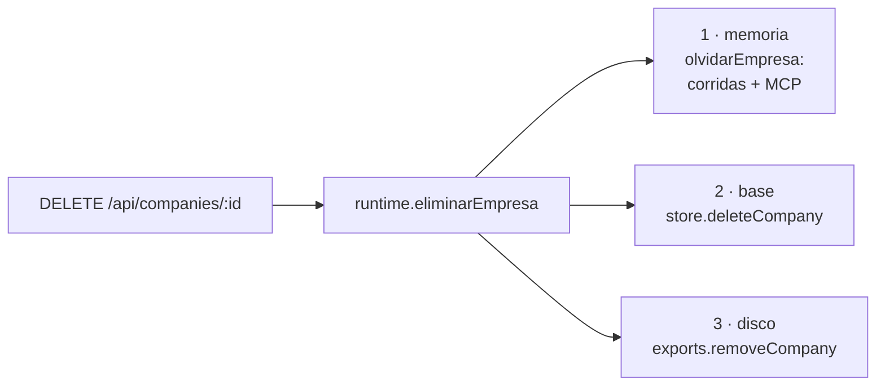

# Limpieza y mantenimiento

> Lo que se acumula acá es **invisible desde el resto de la aplicación**: todas
> las pantallas navegan por empresa, y lo que queda de una empresa borrada ya no
> tiene empresa por la que navegar.

La sección **Mantenimiento** vive al pie de la pestaña **Empresa**
(`apps/web/src/routes/Settings.tsx` → `Mantenimiento`) y arranca cerrada: son las
únicas acciones de esa pantalla que destruyen trabajo, y **ninguna es
reversible** — no hay papelera ni en el disco ni en la base.

## Las cinco acciones

| Acción | Qué se lleva | Qué conserva |
|---|---|---|
| **Vaciar la salida** | lo que produjo la empresa: Word, PDF, videos, decks, imágenes | **lo que subiste vos**, incluido el logo |
| **Borrar la empresa** | agentes, políticas, corridas, entregables, memoria, misiones, conexiones MCP y la carpeta de salida | nada: no queda nadie a quien pertenezca |
| **Corridas terminadas** (global) | mensajes, tareas, aprobaciones, ledger y eventos de todas las empresas | **los entregables** |
| **Filas sueltas** | lo que quedó apuntando a una empresa o corrida inexistente | todo lo que tiene dueño |
| **Carpetas sin empresa** | directorios de `data/exports/` cuya empresa ya no existe | las de empresas vivas |

---

## Borrar una empresa toca tres lugares

Antes sólo hacía el paso 2. Los otros dos existen por dos fallas concretas:

> [!danger] Las conexiones MCP no se caen porque borres filas
> El runtime de empresa sostiene **procesos de servidores MCP**. Sin
> `olvidarEmpresa`, borrar una empresa dejaba sus conexiones vivas hasta
> reiniciar el servidor, y el Hub seguía mostrando en verde los servidores de
> algo que ya no existe. Es `olvidarCorrida` un nivel más arriba, y por el mismo
> motivo.

> [!danger] La carpeta quedaba huérfana para siempre
> La base quedaba limpia pero `data/exports/<empresa>/` seguía ahí con todo lo
> producido, sin ninguna pantalla desde la cual verla.

Si la empresa tiene una corrida en curso, responde **409** y no borra nada:
detenela primero.

## Vaciar la salida usa el manifiesto, no la extensión

El criterio es **`.orq-generado.json` y nada más**.

> [!warning] Un `kind: "all"` se lleva el logo
> El logo de la marca es un `.png` que subiste vos, vive en una ruta fija
> (`marca/logo.png`) y **no se vuelve a generar solo**. Vaciar la salida no puede
> costártelo, así que se compara contra la procedencia y no contra si el archivo
> es multimedia.

Ver [[Habilidades de producción]] para cómo se registra la procedencia.

## Residuos en la base

`Store.residuos()` cuenta y `Store.purgarResiduos()` borra. Hoy los borrados en
cascada no dejan nada suelto, pero **antes sí**: se midieron 10 entregables y 21
corridas apuntando a empresas inexistentes. Una base de esa época sigue
arrastrando esa basura.

### El orden importa

Primero las corridas sin empresa, porque al irse dejan huérfanas sus propias
filas, y recién después el barrido por corrida. Al revés hay que correrlo dos
veces para que quede limpio.

### El diagnóstico cuenta lo mismo que la purga

> [!danger] Un botón destructivo que subdeclara no se vuelve a creer
> La primera versión no contaba la corrida huérfana en sí —`runs` no está en
> `TABLAS_POR_EMPRESA`— ni los mensajes que colgaban de ella, porque comparaba
> contra `runs` a secas y esa corrida todavía existía. Anunciaba **1 fila** y
> borraba **3**.
>
> Ahora `residuos()` compara contra las corridas que **van a sobrevivir**, y hay
> un test que fija que lo anunciado sea exactamente lo borrado.

### Compactar

`VACUUM`. SQLite no le devuelve al sistema el espacio de lo que borrás: lo marca
libre y lo reusa, así que después de purgar una corrida de miles de eventos el
archivo sigue pesando lo mismo y parece que la limpieza no hizo nada.

**No puede correr dentro de una transacción**, así que va suelto y al final.

Sin compactar, el "antes" y el "después" del peso son **iguales a propósito**: es
justamente lo que explica para qué está la opción.

## Las dos listas compartidas

`TABLAS_POR_EMPRESA` y `TABLAS_POR_CORRIDA` (`apps/server/src/db.ts`) las usan
tanto el borrado en cascada como el barrido de residuos.

> Si aparece una tabla nueva y se agrega en un solo lado, el borrado deja basura
> que el barrido no ve — o al revés, el barrido se lleva filas que sí tenían
> dueño. Hay un test que verifica que borrar una empresa no deja residuos.

## Carpetas sin empresa

`ExportStore.carpetasResiduales(idsVivos)` lista los directorios de
`data/exports/` que no corresponden a ninguna empresa, con su peso.

> [!danger] Un diagnóstico que usa `dirFor` produce los residuos que viene a buscar
> `dirFor` crea la carpeta al pasar, así que **cualquier consulta era una
> escritura**: pedir el árbol de una empresa que ya no está alcanzaba para
> dejarla de nuevo en disco. Por eso existe `pathFor`, que resuelve la ruta sin
> crearla, y todo el camino de medición pasa por ahí.

> [!warning] La comparación es contra el id **saneado**
> El nombre real de la carpeta es `safeSegment(companyId)`. Comparar contra el id
> crudo marcaría como residual el directorio de una empresa perfectamente viva, y
> el barrido borraría su trabajo.

### Dos guardias antes de borrar

1. **Sólo lo que el diagnóstico marcó como residual**: si entre el diagnóstico y
   el borrado alguien creó esa empresa, su carpeta ya no está en la lista y no se
   toca.
2. **`removeCarpeta` acepta un solo segmento** y verifica la ruta ya resuelta
   contra la raíz. Acá se borra recursivo, y un `..` costaría el directorio de
   otra empresa.

Verificado a mano contra el servidor: un `../../etc` y el id de una empresa viva
se rechazan los dos.

## Qué NO limpia nada de esto

- **Los entregables al borrar una corrida.** Son de la empresa. Ver
  [[Invariantes de arquitectura]] §12.
- **Lo que subió una persona**, salvo que borres la empresa entera.
- **`data/musica/`**: las pistas son tuyas y tienen licencia.

## API

| Método | Ruta |
|---|---|
| `GET` | `/api/mantenimiento` — diagnóstico, sin borrar nada |
| `POST` | `/api/mantenimiento/purgar` — `{ residuos?, carpetas?, corridas?, compactar? }` |
| `DELETE` | `/api/runs/terminadas` — global |
| `POST` | `/api/companies/:companyId/exports-vaciar` |
| `DELETE` | `/api/companies/:id` — ahora también memoria y disco |

Ver [[Referencia de API]].

## Enlaces

- [[Base de datos]] — respaldo y limpieza por línea de comandos
- [[Persistencia y esquema SQL]]
- [[Habilidades de producción]] — la procedencia
- [[Seguridad]] — el saneo de rutas
