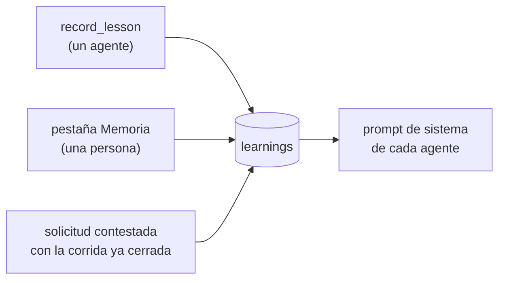

# Memoria de la empresa

> Las corridas son efímeras, pero lo que la empresa **aprende** no: vive a nivel
> empresa y sobrevive.

## El problema que resuelve

Sin memoria, cada corrida vuelve a derivar lo mismo a fuerza de mensajes entre
agentes: la tarifa por hora, el criterio de estimación, que cierto tipo de
cliente pide algo puntual. Eso son tokens que se pagan de nuevo cada vez.

Con memoria, entra en el prompt de la corrida siguiente.

## `Learning`

```ts
{ id, companyId, topic, lesson, authorRoleId, runId, timesConfirmed, createdAt, updatedAt }
```

| Campo | Para qué |
|---|---|
| `topic` | agrupador corto: `"precios"`, `"estimación"`, `"cliente:retail"` |
| `lesson` | la lección en sí, **autocontenida y accionable** |
| `authorRoleId` | quién la registró; `null` si la cargó una persona |
| `runId` | en qué corrida se aprendió, para rastrear su origen |
| `timesConfirmed` | veces que se reafirmó |

## Cómo entra y cómo sale



### Va en el prompt de sistema, no detrás de una herramienta

Es deliberado:

> Detrás de una tool el agente gastaría un turno en descubrirla, otro en
> llamarla, y muchas veces **no la llamaría** — justo el consumo que esto busca
> evitar. En el prompt ya está, cuesta unos cientos de tokens de entrada y se
> cachea.

## Los dos límites

Para que la memoria no cueste más de lo que ahorra:

1. **Deduplicación** por tema y texto normalizado: repetir una lección **sube su
   contador** en vez de crear una fila nueva.
2. **Tope de 25** inyectadas, **las más reafirmadas primero**.

## Sembrarla antes de la primera corrida

> Es la forma más barata de que la empresa arranque sabiendo algo — una tarifa,
> un criterio de estimación, una preferencia de un tipo de cliente.

Desde la pestaña **Memoria**, o por API:
`POST /api/companies/:companyId/learnings`.

## La ruta lateral

Contestar una solicitud cuya corrida ya cerró **no llega a ninguna bandeja**:
`runtime.notifyRequester` la guarda como `Learning` de la empresa, que sí entra
en el prompt de las corridas siguientes. Sin eso, la respuesta se perdía.

## Verificado

23 tests en `packages/engine/src/memory.test.ts`, sin gastar tokens: se siembra,
se agrupa por tema, entra en el prompt, se deduplica y sobrevive a la corrida.

Y medido en una corrida real: un entregable producido con modelos gratuitos
**citó la memoria sembrada** — tomó las "900-1200 horas" y el "plan de migración
sin cortar la operación" de las lecciones en lugar de re-derivarlas. Es la
demostración de que la memoria evita repetir consumo. Ver
[[Estado del producto]].

## Enlaces

- [[Motor de agentes]] — dónde se inyecta
- [[Costos y presupuesto]]
- [[Coordinación entre agentes]] — `record_lesson`
