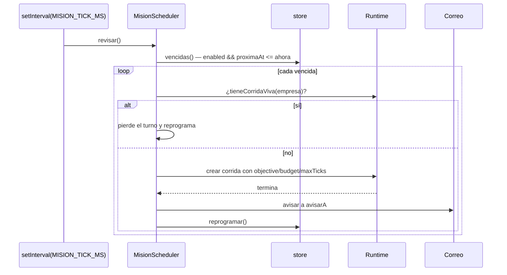
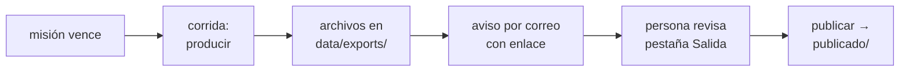

# Misiones programadas

> Una misión es la **receta de una corrida, más cuándo repetirla**.

`misionSchema` en `packages/shared/src/schema.ts`, planificador en
`apps/server/src/misiones.ts`, cálculo de tiempos en
`packages/shared/src/programacion.ts`.

> [!warning] No confundir con `mode: "cron"`
> `mode: "cron"` de una corrida **pacea los ciclos dentro** de esa corrida. Una
> misión **larga una corrida nueva**.

## `Mision`

| Campo | Para qué |
|---|---|
| `objective` | el encargo, tal como se lo daría una persona |
| `programacion` | cuándo dispara — ver abajo |
| `enabled` | pausarla sin borrarla |
| `budgetUsd` · `maxTicks` | los topes de la corrida que genera |
| `avisarA` | a quién se le avisa por correo cuando termina |
| `proximaAt` · `ultimaAt` · `ultimaRunId` | el estado del reloj |

`avisarA` es lo que convierte a la misión en **algo que se revisa antes de
publicar** en vez de algo que pasa sin que nadie se entere.

## Las tres formas de programar

Las mismas del nodo *Schedule* de n8n, porque son las que la gente necesita de
verdad:

| Forma | Ejemplo | Cuándo |
|---|---|---|
| `intervalo` | `{ cada: 6, unidad: "horas" }` | cada tanto |
| `semanal` | `{ dias: [1,3,5], hora: 7, minuto: 0 }` (0 = domingo) | tal día a tal hora |
| `cron` | `{ expresion: "0 0 1 * 1" }` — cinco campos | lo que no entra en las otras dos |

Sin `cron` no se puede pedir "el primer lunes del mes"; sin `semanal` hay que
escribir cron para "todos los días a las 7", que es el caso más común de todos.

`dias` vacío no se acepta: nunca dispararía.

## El cálculo es puro y vive aparte

`packages/shared/src/programacion.ts` → `proximaCorrida(programacion, desde)`.

> El bug clásico de un scheduler es que anda en la máquina de quien lo escribió y
> no el domingo a medianoche.

Dos cosas que se verifican con tests (`programacion.test.ts`) y no se dan por
obvias:

1. **El próximo disparo es estrictamente posterior a `desde`.** Si no, una misión
   que acaba de correr se redispara en el mismo minuto **para siempre**.
2. **Una expresión inválida deja `proximaAt` en `null`** en vez de disparar a
   cualquier hora.

Y una regla de compatibilidad: en cron, día-del-mes y día-de-semana restringidos
son un **OR**, no un AND. Es el comportamiento histórico, y con AND
`0 0 1 * 1` casi no dispararía.

## El planificador es a propósito tonto

### El próximo disparo se guarda en la base

`proximaAt`, no un timer. Un timer por misión **se pierde entero al reiniciar** y
obliga a reprogramarlo cada vez que alguien edita la misión. El planificador se
despierta cada `MISION_TICK_MS` (por defecto 30 s), mira qué venció y larga.

El `setInterval` lleva `unref()` para no impedir que el proceso termine cuando
toca.

### Una empresa, una corrida viva

`tieneCorridaViva`: si la empresa ya tiene una corrida en curso, la misión
**pierde el turno y se reprograma**.

> Dos equipos completos escribiendo sobre los mismos entregables se pisan, y
> queda una versión que mezcla dos trabajos. Perder el turno es más sano.

## El circuito completo

**Publicar es lo único que un agente no puede hacer.** Ver
[[ADR-008 Publicar lo decide una persona]].

## API

`GET` · `POST` · `PATCH` · `DELETE` sobre
`/api/companies/:companyId/misiones[/:id]`, más
`POST /api/companies/:companyId/misiones/:id/run` para dispararla a mano. Ver
[[Referencia de API]].

## Enlaces

- [[Correo y avisos]]
- [[Scheduler y ciclo de una corrida]]
- [[CU-03 Misión semanal con aprobación humana]]
