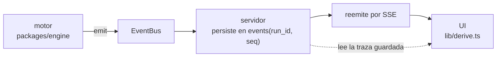

# Observabilidad y trazas

## El invariante

> **Todo lo que pasa tiene que emitir un evento.** Un paso que no emite evento es
> un paso invisible.

Persistir **antes** de reemitir es lo que hace que "ver en vivo" y "retroceder en
el timeline" sean la misma operación con un corte distinto. Por eso el replay
muestra exactamente lo que se vio la primera vez.

## Los dieciséis eventos

`packages/shared/src/events.ts`. Todos comparten `{ id, runId, tick, at }`.

### Ciclo de la corrida
| Evento | Campos propios |
|---|---|
| `run.status` | `status`, `reason` |
| `tick.start` | `activeRoleIds` — los roles que van a ejecutar turno |
| `tick.end` | `messagesEmitted`, `costUsd` |

### Actividad del agente
| Evento | Campos propios | Efecto en la UI |
|---|---|---|
| `agent.thinking` | `roleId`, `providerId`, `modelSlug`, `iteration` | el nodo del organigrama **empieza a pulsar** |
| `agent.turn_end` | `roleId`, `iterations`, `costUsd`, `summary` | deja de pulsar |
| `agent.message` | `messageId`, `from`/`to`, `messageType`, `subject`, `preview` | un paquete **viaja por la arista** |

> [!danger] `agent.turn_end` se emite en `finally`
> Si un turno falla y no lo emite, el nodo queda "pensando…" para siempre.

### Herramientas
| Evento | Campos propios |
|---|---|
| `tool.selection` | `candidates`, `exposed`, `strategy` (`all`\|`ranked`), `reason` |
| `tool.start` | `callId`, `toolName`, `origin`, `mcpServerId`, `args` |
| `tool.end` | `callId`, `durationMs`, `ok`, `preview` (recorte de ≤2000), `error` |

`tool.selection` se emite **antes** de la llamada al modelo, cuando el router ya
decidió qué exponer: hace visible una decisión que de otro modo sería invisible.
La UI lo muestra como *"por qué tenía esta herramienta a mano"*. Ver
[[Herramientas y tool router]].

### MCP
`mcp.status` — `serverId`, `serverName`, `status`, `toolCount`, `handshakeMs`,
`error`. Cambia el semáforo del Hub, y va por el canal SSE **global**.

### Trabajo
| Evento | Campos propios |
|---|---|
| `task.changed` | `taskId`, `title`, `assigneeRoleId`, `status`, `created` |
| `artifact.created` | `artifactId`, `key`, `title`, `version`, `authorRoleId` |
| `request.created` | `requestId`, `requestType`, `reason`, `summary` |
| `approval.changed` | `approvalId`, `status`, `reason`, `toolName` |

`task.changed.created` es `true` sólo en la creación, para animarla distinto que
una actualización.

### Costo
`cost.updated` — `deltaUsd`, `totalUsd`, `budgetUsd`, `inputTokens`,
`outputTokens`, `cachedInputTokens`. Es lo que dibuja la barra de presupuesto en
vivo. Ver [[Costos y presupuesto]].

### Diagnóstico
`log` — `level` (`debug`\|`info`\|`warn`\|`error`), `message`, `roleId`.

## Cada paso emite **antes** de ejecutarse

No después de terminar. Así la UI muestra lo que está pasando y no un resumen a
posteriori.

## Auditoría dentro de la corrida

Aparte de la traza, `RunState.activity` graba cada llamada a herramienta con su
resultado real —lo graba el agent loop, no el agente— y se expone a los propios
agentes por `check_activity`, filtrable por rol. Últimas 500 entradas.

Es lo único que detecta **ejecutar algo con éxito y después informar que no se
pudo**. Ver [[Coordinación entre agentes]].

## Cómo se consume

| Consumidor | Cómo |
|---|---|
| UI en vivo | `GET /api/runs/:id/stream` (SSE) → `lib/stream.ts` → `lib/derive.ts` |
| Replay | `GET /api/runs/:id/events` — la traza guardada, ordenada por `seq` |
| MCP Hub | `GET /api/mcp/stream` (SSE global) |

La UI **no hace polling**. Ver [[Frontend web]].

## Enlaces

- [[Referencia de eventos]] — la tabla campo por campo
- [[Cómo agregar un evento]]
- [[API HTTP y SSE]]
