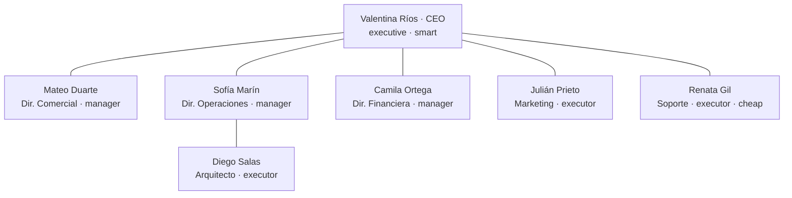

# CU-01 Propuesta comercial

**Qué se quiere lograr:** que la empresa arme una propuesta comercial completa —
alcance técnico, estimación de esfuerzo, precio y margen — a partir de un encargo
en una frase.

## Configuración

`npm run db:seed` siembra **Codytion S.A.**: consultora de software de 40
personas, proyectos de US$30.000 a US$250.000, margen objetivo 35%.

Herramientas asignadas: `web_search` y `fetch_url` a quienes investigan; las de
exportar al Director Comercial, que es quien cierra la propuesta. Las de
coordinación las tienen todos, siempre.

Tres políticas: **Margen mínimo** (35%, con `gate` que exige aprobación de la
CEO), **Estimaciones fundamentadas** y **Una sola propuesta**.

Ver [[Empresas de ejemplo]].

## El recorrido

### 1. El encargo
En **Proceso en vivo**, con la empresa seleccionada:

> "Retail Andina pide una plataforma de gestión de inventario multi-sucursal.
> Armá la propuesta."

Modo `manual` para ver ciclo a ciclo, o `continuous` para dejarla correr.

### 2. Ciclo 1 — la CEO descompone
El nodo de Valentina pulsa (`agent.thinking`). Su prompt le dice que **decide y
desbloquea, no ejecuta**: descompone el encargo y lo delega con un objetivo claro
y un criterio de "terminado".

Se ven paquetes viajando por las aristas (`agent.message`) y tareas nuevas en el
tablero (`task.changed` con `created: true`).

### 3. Ciclo 2 — el trabajo lateral
Acá aparece lo que distingue al sistema: Operaciones le pide el desglose técnico
a su arquitecto; Comercial le pide a Operaciones el alcance y a Finanzas el
precio; Marketing acerca diferenciales.

**Nadie ve el contexto del otro**: cada uno sabe sólo lo que le escribieron.

> Recordá el [[Scheduler y ciclo de una corrida|tick de retardo]]: lo que se
> emite en el ciclo 2 se lee en el 3.

### 4. Ciclo 3 — el margen y el `gate`
Camila calcula costo, precio y margen con `calcular`. Si el precio que pide
Comercial rompe el 35%, la política se lo dice y el `gate` exige aprobación de la
CEO: se abre una `ApprovalRequest` y **esa rama del trabajo queda detenida**.

La resolvés desde la UI, o la resuelve la CEO si tiene autoridad.

### 5. Ciclo 4 — el entregable
Comercial llama `write_artifact` con la propuesta en markdown, y después
`export_docx` con la clave. Aparece en **Entregables** y el archivo en
`data/exports/codytion-sa/`.

Ver [[Habilidades de producción]] para por qué son dos llamadas y no una.

## Qué mirar

| Dónde | Qué demuestra |
|---|---|
| **Organigrama** | las aristas laterales: Comercial↔Operaciones↔Finanzas. No es un árbol de delegación, es una red |
| **Actividad** | `tool.selection` con el motivo: por qué cada agente tenía sus herramientas a mano |
| **Costos** | el gasto por rol. La CEO en `smart` cuesta más por turno que Soporte en `cheap` |
| **Timeline** | retrocedé y volvé a mirar el ciclo 2. Es exactamente lo que se vio en vivo |
| **Salida** | el `.docx` con portada, quién firma, tablas con bordes y pie numerado |

## Qué puede salir mal

| Síntoma | Causa probable |
|---|---|
| la CEO se va a descargar PDFs al azar en vez de delegar | tier `cheap` en un rol que coordina — ver [[Capa LLM y tiers]] |
| la corrida muere en el ciclo 3 sin producir nada | 402 del proveedor: cuenta sin crédito. `npm run check:llm` |
| tres entregables fragmentados en vez de uno | modelo barato fragmentando; la guardia de claves-variante lo frena, pero revisá el tier |
| el mismo agente toma turno catorce ciclos sin ejecutar nada | livelock por tarea abierta — ver [[Scheduler y ciclo de una corrida]] |
| la corrida termina "completed" en 3 ciclos sin entregable | es un pedido perdido, no un éxito: mirá los reencolados en la actividad |

Ver [[Diagnóstico de problemas]].

## Variantes

- **Sembrar la memoria antes de correr** (pestaña Memoria): una tarifa por hora,
  un criterio de estimación. La corrida siguiente los cita en vez de
  re-derivarlos. Ver [[Memoria de la empresa]].
- **Agregar un revisor**: ver [[CU-04 Control de calidad entre agentes]].
