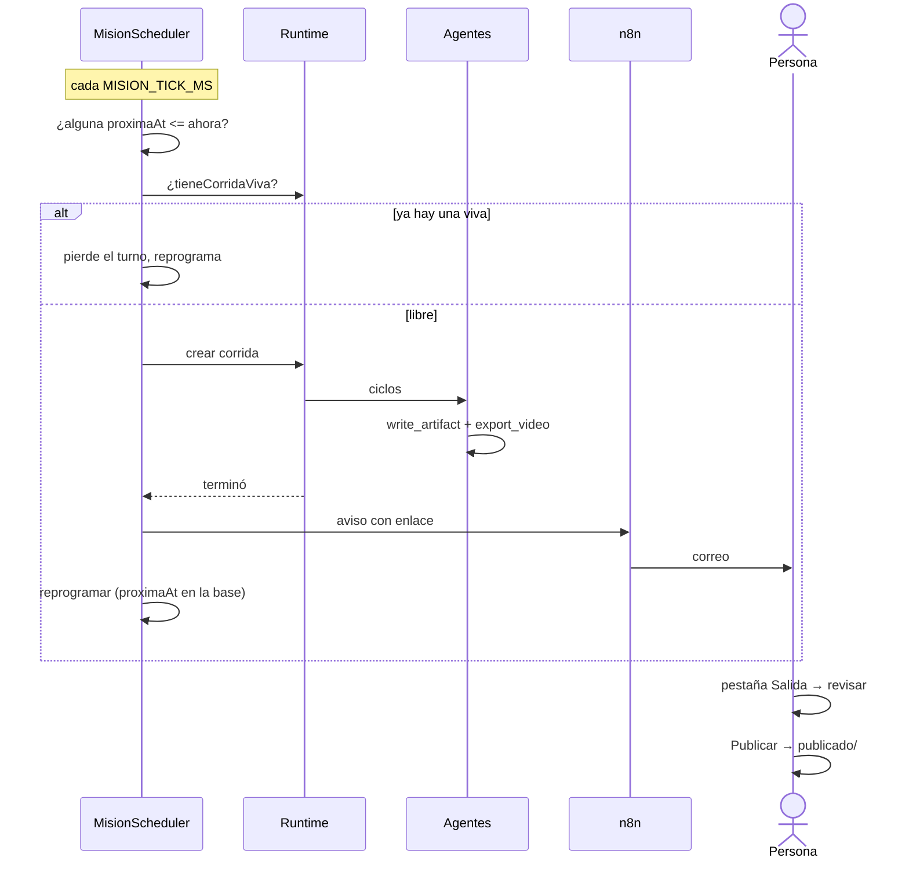

# CU-03 Misión semanal con aprobación humana

**Qué se quiere lograr:** que un encargo se dispare solo todas las semanas,
produzca, avise por correo, y **espere** a que una persona lo apruebe antes de
publicar.

## Configuración

### 1. El correo

En `.env`:

```
N8N_EMAIL_WEBHOOK_URL=https://tu-n8n/webhook/correo
API_URL=http://localhost:3001
APP_URL=http://localhost:5173
MISION_TICK_MS=30000
```

Del lado de n8n: un nodo *Webhook* → *Send Email*, mapeando `to`, `subject`,
`text` y `attachments`. Ver [[Correo y avisos]].

> Sin el webhook, la misión **corre igual pero no avisa**, y `send_email` falla
> diciendo exactamente qué falta.

### 2. La misión

Pestaña **Empresa** → Misiones, o por API:

```jsonc
{
  "name": "Institucional semanal",
  "objective": "Armá una pieza institucional corta sobre un caso de esta semana…",
  "programacion": { "type": "semanal", "dias": [1], "hora": 7, "minuto": 0 },
  "enabled": true,
  "budgetUsd": 2,
  "maxTicks": 12,
  "avisarA": ["comercial@empresa.com"]
}
```

Tres formas de programar: `intervalo`, `semanal` y `cron`. Ver
[[Misiones programadas]].

## El recorrido



### El próximo disparo se guarda en la base

`proximaAt`, no un timer. Un timer por misión se pierde entero al reiniciar el
servidor. El planificador se despierta cada `MISION_TICK_MS`, mira qué venció y
larga.

### Una empresa, una corrida viva

Si la empresa ya tiene una corrida en curso, la misión **pierde el turno y se
reprograma**. Dos equipos completos escribiendo sobre los mismos entregables se
pisan.

### Publicar es de la persona

`ExportStore.publicar` mueve el archivo a `publicado/`. **No existe una
herramienta `publicar` en el catálogo.** Así "aprobado" es un hecho verificable
en el disco y no un estado que hay que creer. Ver
[[ADR-008 Publicar lo decide una persona]].

## Qué mirar

- **`proximaAt` sobrevive a un reinicio del servidor.** Apagá y prendé: la misión
  sigue programada para el mismo momento.
- **Una expresión cron inválida deja `proximaAt` en `null`**, no dispara a
  cualquier hora.
- **El adjunto del correo es un enlace al servidor local**, no bytes: se abre
  desde la misma red.
- **La carpeta `publicado/`** dentro del directorio de la empresa: ahí está lo
  aprobado, y sólo eso.

## Qué puede salir mal

| Síntoma | Causa |
|---|---|
| la misión no dispara nunca | `enabled: false`, o `proximaAt` en `null` por expresión inválida |
| la misión se redispara en el mismo minuto, para siempre | el próximo disparo tiene que ser **estrictamente posterior** a `desde` — cubierto por tests, pero es el bug a mirar si tocás `programacion.ts` |
| `0 0 1 * 1` dispara más de lo esperado | día-del-mes y día-de-semana restringidos son un **OR**, no un AND. Es el comportamiento histórico |
| la misión se saltea turnos | ya había una corrida viva de esa empresa |
| llega el correo sin adjunto abrible | `API_URL` apunta a un host que quien recibe no alcanza |
| no llega ningún correo | falta `N8N_EMAIL_WEBHOOK_URL`, o el flujo de n8n no está activo |

## Disparar a mano

`POST /api/companies/:companyId/misiones/:id/run` — útil para probar la misión sin
esperar al turno. Ver [[Referencia de API]].

## Enlaces

- [[Misiones programadas]]
- [[Correo y avisos]]
- [[CU-02 Video institucional]] — qué produce la misión
