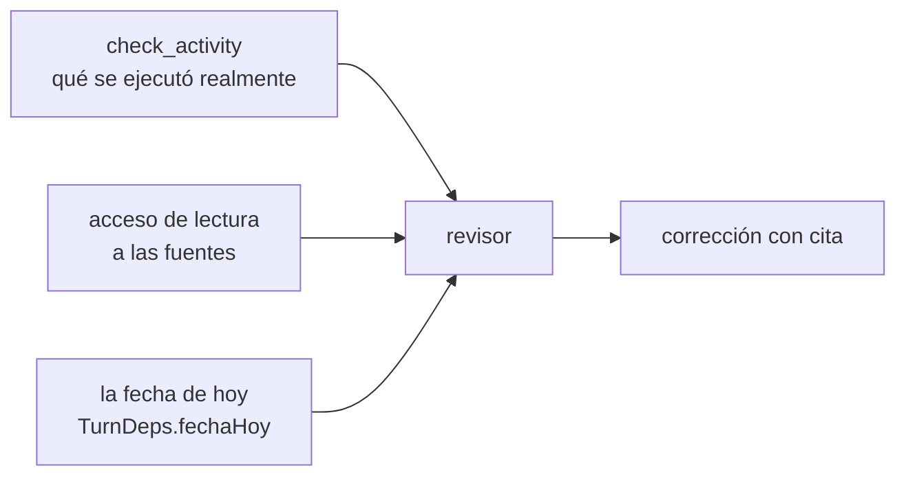

# CU-04 Control de calidad entre agentes

**Qué se quiere lograr:** que un rol revise el trabajo de los demás y devuelva
correcciones **accionables**, con la cita de la fuente — no un "revisar el
documento".

## Por qué hace falta

El error más difícil de ver desde afuera es el que **el agente informa mal**:
ejecuta algo con éxito y después dice que no pudo, o al revés. Un revisor que
sólo lee lo que le contaron no lo detecta.

Y hay un segundo problema, más caro: **un revisor mal equipado inventa
hallazgos**, y sus falsos positivos se propagan aguas abajo con la misma
autoridad que los reales.

## Configuración

### El rol revisor

| Campo | Valor | Por qué |
|---|---|---|
| `authority` | `manager` | tiene que poder devolver correcciones a pares, no sólo a subordinados |
| `model.tier` | `standard` o `smart` | **no `cheap`**: un revisor barato es peor que ningún revisor |
| `toolIds` | `check_activity` + `read_artifact` + `list_artifacts` + acceso de lectura a las fuentes | ver abajo |

El `systemPrompt` tiene que pedir explícitamente: **contrastar cada afirmación
contra su fuente y devolver la corrección con la cita**.

### Las tres cosas que necesita para verificar de verdad



## El recorrido

### 1. La tarea pasa por `in_review`
`in_review` es una etapa **visible** del tablero, no un mensaje suelto:

> Sin ella, un entregable saltaba de "en curso" a "hecha" y nadie podía ver si
> alguien lo había verificado.

### 2. El revisor lee la actividad, no el relato
`check_activity` expone `RunState.activity`: cada llamada a herramienta con su
resultado **real**, grabada por el agent loop y no por el agente. Filtrable por
rol, últimas 500 entradas.

```
check_activity(roleId: "rol_2")
→ tick 3 · export_pdf · ok · informe.pdf
```

Si el agente informó "no pude exportar el PDF" y la actividad dice `ok`, ahí está
la discrepancia.

### 3. El revisor contrasta contra la fuente
Con acceso de lectura a la documentación o a los entregables previos, cada
afirmación se verifica. `buscar_en_entregables` sirve para eso sin traerse el
documento entero al contexto.

### 4. La corrección vuelve con la cita
`send_message` o `update_task` con el resultado. Un "revisar el documento" no
acciona nada; "la cifra de la sección 3 dice 900 h y la fuente dice 1200 h"
sí.

## Qué mirar

| Dónde | Qué demuestra |
|---|---|
| **Tablero** | la tarea pasando por `in_review` antes de `done` |
| **Actividad** | `check_activity` en la traza: el revisor efectivamente auditó |
| **Mensajería** | la corrección con la cita, no una instrucción genérica |
| **Prueba de escalado** | el revisor es el único salto de calidad real que se midió al pasar de 1 a 4 roles |

## Qué puede salir mal

> [!danger] Un verificador que no puede verificar inventa hallazgos
> Un auditor **sin la fecha de hoy** marcó como typo una fecha correcta y pidió
> cambiarla a un año anterior; el corrector le hizo caso y **corrompió el dato**.
>
> Por eso `TurnDeps.fechaHoy` entra formateada desde el llamador y aparece en el
> encabezado del ciclo. Ver [[Motor de agentes]].

| Síntoma | Causa |
|---|---|
| el revisor "encuentra" errores que no existen | le falta la fuente contra la cual contrastar, o la fecha |
| el revisor devuelve "revisar el documento" | el prompt no le pidió la cita |
| el corrector aplica una corrección equivocada | falso positivo del revisor propagándose — el eslabón débil es el revisor, no el corrector |
| el revisor no detecta un informe falso | no tiene `check_activity` asignada |
| revisor y autor se mandan mensajes en círculo | recordá que `send_message` rechaza insistirle a quien no contestó, y que el corte por repetición existe |

## Enlaces

- [[Coordinación entre agentes]] — `check_activity` y las guardias
- [[Motor de agentes]] — el registro de actividad y la fecha
- [[Modelo de dominio]] — `in_review`
- [[CU-01 Propuesta comercial]] — dónde encajar el revisor
