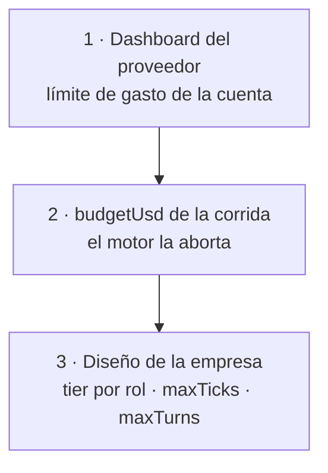

# Costos y presupuesto

## Las tres capas de contención



> [!warning] La capa 2 no alcanza sola
> El tope se evalúa **antes de cada turno, no durante**: una sola llamada cara
> puede pasarse del tope antes de que se detecte. **Configurá también un límite
> en el dashboard de tu proveedor.**

## El ledger

`packages/llm/src/ledger.ts` → `RunLedger`. Por llamada registra:

| Campo | Notas |
|---|---|
| `inputTokens` · `outputTokens` | |
| `cachedInputTokens` | de los de entrada, cuántos sirvió el proveedor desde su caché |
| `costUsd` | **el que informa el proveedor** cuando lo informa; si no, estimado con el precio del catálogo |
| `latencyMs` | |
| `roleId` · `providerId` · `modelSlug` · `tick` | para atribuir |

Cada entrada emite un `cost.updated` con `deltaUsd`, `totalUsd` y `budgetUsd`,
que es lo que dibuja la barra en vivo. Pestaña **Costos**.

## Dónde se va el dinero

**No es la salida: es la entrada.** Un agente manda en cada iteración el
historial completo, las definiciones de herramientas y la bandeja. Por eso el
precio mezclado que usa la resolución de tiers pesa la entrada al 80%:

```
blendedPrice = entrada × 0.8 + salida × 0.2
```

> [!danger] El caso de los 534k tokens
> Un `read_artifact` con un argumento inventado (`start=4000`) hacía que el mismo
> entregable de 40k caracteres entrara **once veces** al contexto: 534k tokens de
> entrada para 2k de salida — una relación de **259:1**.
>
> La huella del memo ahora se calcula sólo sobre lo que el esquema declara. Y una
> relectura devuelve un puntero: ahorrar el viaje al servidor no servía de nada,
> el costo está en los tokens que se reenvían en cada iteración.

## Las siete palancas

| Palanca | Efecto |
|---|---|
| **tier por rol** | ejecutores en `cheap`, coordinadores en `standard`, decisiones en `smart`. Es la palanca más grande |
| **`maxTurns` por rol** | iteraciones dentro de un turno (por defecto 8) |
| **`maxTicks` de la corrida** | ciclos totales |
| **`budgetUsd`** | el corte duro |
| **memoria de la empresa** | no re-derivar lo que ya se estableció. Ver [[Memoria de la empresa]] |
| **tool router** | menos herramientas expuestas = menos contexto por iteración |
| **Ollama** | local, **costo cero** |

## Presión de cierre

Cada turno recibe cuánto queda de ciclos y de presupuesto, y **manda el más
apremiante de los dos**. Sin ella, los agentes se piden información entre sí hasta
que la corrida muere por presupuesto sin producir nada. Ver [[Motor de agentes]].

## Órdenes de magnitud medidos

| Escenario | Costo |
|---|---|
| corrida de 4 ciclos, 8 mensajes, 4 tareas, 1 entregable, tier `free` | **US$0.00** |
| tope por defecto de una corrida | `DEFAULT_RUN_BUDGET_USD=1.00` |
| lo que evita el techo de `smart` | hay modelos a **US$60/MTok**: un turno se comería el presupuesto |
| prima de una variante `-fast` | el doble, por velocidad y no por calidad — penalizada con −6 |

## Verificar precios antes de correr

```bash
npm run check:models      # qué modelo resuelve cada tier, con precio real y el motivo
```

## Qué hacer si una corrida se corta por presupuesto

`status: "budget_exceeded"` con el motivo visible en la UI. **El entregable
sobrevive**: `write_artifact` ya lo guardó, y los artefactos no se pierden al
borrar la corrida.

Bajá el tier de los roles que no deciden, subí `budgetUsd`, o sembrá memoria para
que la corrida siguiente no re-derive lo mismo.

## Enlaces

- [[Capa LLM y tiers]]
- [[ADR-004 Bandas de precio disjuntas]]
- [[Memoria de la empresa]]
- [[Variables de entorno]]
