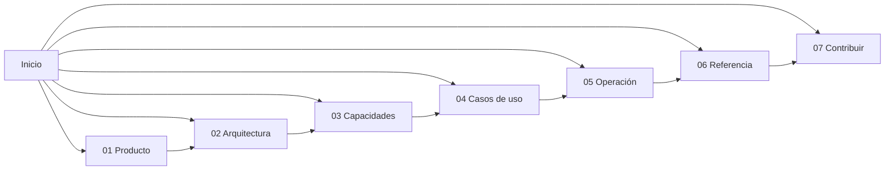

# Orquestador Agéntico — documentación

> Plataforma para **modelar una empresa completa con agentes LLM y verla operar**.
> Configurás departamentos, roles, herramientas y políticas; le das un encargo; y
> mirás cómo los agentes se escriben entre sí, delegan, escalan, piden aprobación
> y producen entregables reales — con el costo a la vista y un tope que corta solo.

Esta bóveda documenta el producto, la arquitectura, las capacidades, los casos de
uso y la operación. Si es tu primera vez, seguí [[Cómo navegar esta bóveda]].

---

## Por dónde entrar

| Si sos… | Empezá por |
|---|---|
| alguien que quiere entender **qué hace** | [[Visión del producto]] → [[Casos de uso]] |
| desarrollador que va a **tocar el código** | [[Arquitectura general]] → [[Invariantes de arquitectura]] → [[Trampas conocidas]] |
| quien lo va a **poner a correr** | [[Instalación y arranque]] → [[Variables de entorno]] → [[Comandos]] |
| quien va a **diseñar una empresa** | [[Modelo de dominio]] → [[Empresas de ejemplo]] → [[Catálogo de herramientas]] |
| quien busca **un dato puntual** | [[Referencia de API]] · [[Referencia de eventos]] · [[Referencia de esquemas]] |

---

## Mapa de la bóveda

### 00 · Meta
- [[Cómo navegar esta bóveda]]
- [[Convenciones de documentación]]
- [[Glosario]]

### 01 · Producto
- [[Visión del producto]] — qué es y por qué existe
- [[Problema y público]] — a quién le sirve
- [[Estado del producto]] — qué está verificado y qué no
- [[Hoja de ruta]] — lo próximo y lo descartado

### 02 · Arquitectura
- [[Arquitectura general]] — el diagrama y el flujo completo
- [[Invariantes de arquitectura]] — las reglas que no se rompen
- [[Mapa del monorepo]] — qué vive en cada paquete
- [[Modelo de dominio]] — empresa, rol, corrida, entregable
- [[Motor de agentes]] — el agent loop
- [[Scheduler y ciclo de una corrida]] — el tick
- [[Capa LLM y tiers]] — proveedores, modelos, costo
- [[Herramientas y tool router]] — cómo el agente elige
- [[Integración MCP]] — servidores externos
- [[Persistencia y esquema SQL]] — qué sobrevive
- [[API HTTP y SSE]] — el contrato del servidor
- [[Frontend web]] — las nueve pantallas
- [[Decisiones de arquitectura]] — los ADR

### 03 · Capacidades
- [[Gestión de proyectos]]
- [[Catálogo de herramientas]]
- [[Coordinación entre agentes]]
- [[Habilidades de producción]]
- [[Producción audiovisual]]
- [[Íconos y visuales vectoriales]]
- [[Música y narración]]
- [[Memoria de la empresa]]
- [[Misiones programadas]]
- [[Correo y avisos]]
- [[Observabilidad y trazas]]
- [[Limpieza y mantenimiento]]

### 04 · Casos de uso
- [[Casos de uso]] (índice)

### 05 · Operación
- [[Instalación y arranque]] · [[Variables de entorno]] · [[Comandos]]
- [[Base de datos]] · [[Pruebas y calidad]] · [[Diagnóstico de problemas]]
- [[Costos y presupuesto]] · [[Seguridad]]

### 06 · Referencia
- [[Referencia de API]] · [[Referencia de eventos]] · [[Referencia de esquemas]]
- [[Referencia de herramientas]] · [[Empresas de ejemplo]]

### 07 · Contribuir
- [[Guía de contribución]]
- [[Cómo agregar un proveedor LLM]] · [[Cómo agregar una herramienta]] · [[Cómo agregar un evento]]
- [[Trampas conocidas]]

---

## Los tres conceptos que hay que entender sí o sí

1. **Un rol es un agente con bandeja propia.** No comparten contexto: cada uno
   sabe sólo lo que le escriben. Ver [[Coordinación entre agentes]].
2. **Un tick es un ciclo de la empresa.** Lo que un agente emite entra a las
   bandejas del ciclo *siguiente*. Ver [[Scheduler y ciclo de una corrida]].
3. **Todo lo que pasa emite un evento.** La UI deriva su estado de la traza, no
   hace polling. Ver [[Observabilidad y trazas]].
